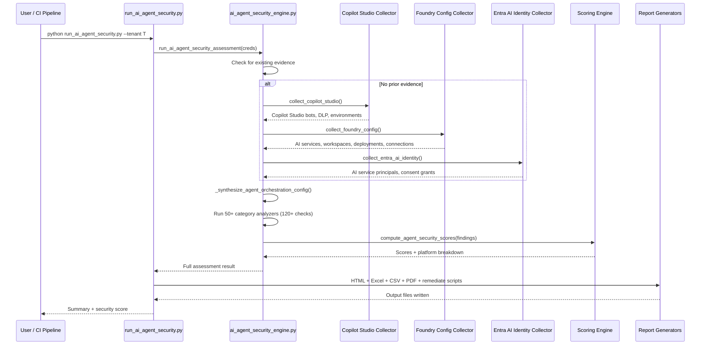

# AI Agent Security Engine — Deep Dive

> **Executive Summary** — Deep technical reference for the AI Agent Security Engine
> (`ai_agent_security_engine.py`, 6,611 lines). Assesses AI agent security across 6 platforms
> (Copilot Studio, Azure AI Foundry, Azure OpenAI, Azure ML, custom agents, Entra-connected apps),
> 50+ categories, and 120+ individual checks. The canonical AI agent security reference.
>
> | | |
> |---|---|
> | **Audience** | AI/ML security engineers, platform architects |
> | **Prerequisites** | [Architecture](architecture.md) for pipeline context |
> | **Companion docs** | [Evaluation Rules](evaluation-rules.md) · [Copilot Readiness](copilot-readiness-deep-dive.md) |

## Overview
- 6,611 lines, purely functional (no classes)
- Assesses security posture of AI agents across 6 platforms
- 50+ assessment categories, 120+ individual security checks
- Consumes 25+ evidence types across Copilot Studio, Azure AI Foundry, Entra ID, and Azure infrastructure
- Produces severity-scored findings with remediation guidance

## Platforms Covered (6)

| # | Platform | Prefix | Categories | Checks |
|---|----------|--------|------------|--------|
| A | Copilot Studio Agents | `cs_` | 15 | ~49 |
| B | Microsoft Foundry Agents | `foundry_` | 24 | ~58 |
| C | Custom Agent Security | `custom_` | 3 | ~4 |
| D | Entra Identity for AI | `entra_ai_` | 6 | ~20 |
| E | AI Infrastructure | `ai_` | 4 | ~9 |
| F | Agent Orchestration | `agent_` | 4 | ~8 |

## Architecture

### Pipeline Flow
1. Evidence collection (reuse or targeted collection from 3 collectors)
2. Synthesize cross-platform evidence (agent-orchestration-config)
3. Run platform-specific analyzers (6 platforms × N categories)
4. Score and aggregate results
5. Report generation (HTML, Excel, CSV, PDF, remediation scripts)

### Sequence Diagram


## Platform A: Copilot Studio Agents (15 categories, ~49 checks)

### Core Checks (8 categories)
| Category | Function | Key Checks |
|----------|----------|------------|
| Authentication | `analyze_cs_authentication` | No auth required (critical), non-AAD auth, stale auth config |
| Data Connectors | `analyze_cs_data_connectors` | No PP DLP policies, unmanaged environments, no security group |
| Logging | `analyze_cs_logging` | No conversation logging, environment audit disabled |
| Channels | `analyze_cs_channels` | Unauthenticated web channel (critical), Teams SSO missing |
| Knowledge Sources | `analyze_cs_knowledge_sources` | Overshared knowledge, external sources, public URLs |
| Generative AI | `analyze_cs_generative_ai` | No content moderation guardrails, unrestricted orchestration |
| Governance | `analyze_cs_governance` | Unpublished bots with secrets, not solution-aware, stale drafts |
| Connector Security | `analyze_cs_connector_security` | Custom connector no auth, premium uncontrolled, no DLP |

### Deep Dive Phases L-Q (7 categories)
| Phase | Category | Key Checks |
|-------|----------|------------|
| L | DLP Depth | No-auth connector allowed, knowledge sources unrestricted, HTTP unrestricted, no tenant policy |
| M | Environment Governance | Bots in default env, no tenant isolation (critical), gen-AI unrestricted |
| N | Agent Security Advanced | No sign-in required, generic OAuth, DLP not enforcing (critical), shared to everyone (critical) |
| O | Audit Compliance | No Purview integration, no DSPM for AI, cross-geo data movement |
| P | Dataverse Security | Maker access in prod, no Customer Lockbox, no CMK |
| Q | Readiness Cross-check | Managed env coverage, DLP coverage (critical), cross-tenant isolation |

## Platform B: Microsoft Foundry Agents (24 categories, ~58 checks)

| Category | Function | Key Checks |
|----------|----------|------------|
| Network | `analyze_foundry_network` | Public access, missing private endpoints |
| Identity | `analyze_foundry_identity` | Local auth enabled, no managed identity |
| Content Safety | `analyze_foundry_content_safety` | Missing content filters, weak filter strength |
| Deployments | `analyze_foundry_deployments` | Excessive capacity, deprecated models, no RAI policy |
| Governance | `analyze_foundry_governance` | No hub/project structure, no CMK, no project isolation |
| Compute | `analyze_foundry_compute` | Public IP, SSH enabled, no idle shutdown, no MI |
| Datastores | `analyze_foundry_datastores` | Credential-based access, no encryption |
| Endpoints | `analyze_foundry_endpoints` | Public access, key auth, no logging |
| Registry | `analyze_foundry_registry` | Public access, no RBAC |
| Connections | `analyze_foundry_connections` | Static credentials, shared-to-all, expired credentials |
| Serverless | `analyze_foundry_serverless` | Key auth, no content safety, no key rotation |
| Diagnostics | `analyze_foundry_ws_diagnostics` | No diagnostic settings, no Log Analytics |
| Prompt Shields | `analyze_foundry_prompt_shields` | No prompt injection filter, jailbreak disabled, no blocklists |
| Model Catalog | `analyze_foundry_model_catalog` | Unapproved models, outdated versions |
| Data Exfiltration | `analyze_foundry_data_exfiltration` | No managed network, unrestricted FQDN outbound |
| Agent Identity | `analyze_foundry_agent_identity` | No project MI, shared identity, permission drift |
| Agent Application | `analyze_foundry_agent_application` | Public endpoint, no auth, unhealthy deployments |
| MCP Tools | `analyze_foundry_mcp_tools` | MCP no auth, public endpoint, shared-to-all |
| Tool Security | `analyze_foundry_tool_security` | No A2A auth, non-Microsoft tools, credential-based |
| Guardrails | `analyze_foundry_guardrails` | No custom guardrails, permissive thresholds |
| Hosted Agents | `analyze_foundry_hosted_agents` | No VNet integration, unhealthy hosts |
| Data Resources | `analyze_foundry_data_resources` | No MI on data connections, no CMK, shared-to-all |
| Observability | `analyze_foundry_observability` | No diagnostics, no App Insights tracing |
| Lifecycle | `analyze_foundry_lifecycle` | Shadow agents, excess unpublished, no RBAC |

## Platform C: Custom Agent Security (3 categories)
| Category | Key Checks |
|----------|------------|
| API Security | Key without network restriction (critical), no CMK |
| Data Residency | Multi-region sprawl (>3 regions) |
| Content Leakage | Content filter gaps |

## Platform D: Entra Identity for AI (6 categories, ~20 checks)
| Category | Key Checks |
|----------|------------|
| AI Service Principals | Excessive permissions, credential expiry/rotation, multi-tenant, no MI, AI API over-scoped |
| AI Conditional Access | No CA policy, no token lifetime, weak CA, no session controls |
| AI Consent | Broad user consent, admin consent high-priv, AI-specific consent scopes |
| Workload Identity | WIF missing for AI service principals |
| Cross-Tenant | Cross-tenant AI exposure |
| Privileged Access | PIM missing for AI roles |

## Platform E: AI Infrastructure (4 categories)
| Category | Key Checks |
|----------|------------|
| Diagnostics | No diagnostic settings, no audit logging |
| Model Governance | Outdated model versions, no rate limiting, excessive rate limits (>250K TPM) |
| Threat Protection | No prompt injection filter, no groundedness check, no PII filter, jailbreak disabled |
| Data Governance | No training data classification, no data retention policy |

## Platform F: Agent Orchestration (4 categories)
| Category | Key Checks |
|----------|------------|
| Defender Coverage | No Defender for AI, alert suppressions |
| Policy Compliance | No AI-specific policies, non-compliant resources |
| Agent Communication | No inter-agent auth, unrestricted tool access, unencrypted memory |
| Agent Governance | No agent inventory, no human-in-loop approval, shadow agents |

## Evidence Types (25+)
| Evidence Type | Platform |
|---|---|
| `copilot-studio-bot` | Copilot Studio |
| `copilot-studio-summary` | Copilot Studio |
| `pp-environment` | Power Platform |
| `pp-dlp-policy` | Power Platform |
| `pp-custom-connector` | Power Platform |
| `pp-tenant-settings` | Power Platform |
| `m365-audit-config` | M365 |
| `m365-dspm-for-ai` | M365 |
| `azure-ai-service` | Azure AI |
| `azure-ai-workspace` | Azure AI Foundry |
| `azure-ai-compute` | Azure AI Foundry |
| `azure-ai-datastore` | Azure AI Foundry |
| `azure-ai-endpoint` | Azure AI Foundry |
| `azure-ai-connection` | Azure AI Foundry |
| `azure-openai-deployment` | Azure OpenAI |
| `azure-openai-content-filter` | Azure OpenAI |
| `foundry-project` | AI Foundry |
| `foundry-agent-application` | AI Foundry |
| `entra-ai-service-principal` | Entra ID |
| `entra-ai-consent-grant` | Entra ID |
| `azure-defender-plan` | Defender |
| `azure-policy-assignment` | Azure Policy |
| `agent-orchestration-config` | Synthesized |

## Scoring Model
Same severity weights as other engines:
- Critical: 10.0, High: 7.5, Medium: 5.0, Low: 2.5, Informational: 1.0
- Per-category: `min(100, sum(weight) × 5)`
- Overall: weighted average by finding count
- Levels: ≥75 Critical, ≥50 High, ≥25 Medium, <25 Secure
- Also includes: PlatformBreakdown and ComplianceBreakdown

## CLI Usage

```bash
# Full assessment
python run_ai_agent_security.py --tenant <tenant-id>

# Reuse evidence
python run_ai_agent_security.py --tenant <tenant-id> --evidence raw-evidence.json

# Target categories
python run_ai_agent_security.py --tenant <tenant-id> --category cs_authentication,foundry_network

# Trend comparison
python run_ai_agent_security.py --tenant <tenant-id> --previous-run prior-assessment.json

# CI/CD gate
python run_ai_agent_security.py --tenant <tenant-id> --fail-on-severity critical
```

## Output Artifacts
| File | Format | Content |
|------|--------|---------|
| `ai-agent-security-assessment.json` | JSON | Full results |
| `ai-agent-security-report.html` | HTML | Interactive dashboard |
| `ai-agent-security-report.xlsx` | Excel | Tabular export |
| `ai-agent-security-findings.csv` | CSV | Flat finding list |
| `remediate.ps1` / `remediate.sh` | Scripts | Auto-generated remediation |
| `*.pdf` | PDF | Converted from HTML |

## Key Constants
| Constant | Value | Purpose |
|----------|-------|---------|
| Deprecated models | `gpt-35-turbo-0301/0613`, `gpt-4-0314/0613`, `text-davinci-*` | Model governance |
| Known models | 18 approved model names | Unapproved model detection |
| High-priv Graph perms | `Directory.ReadWrite.All`, `Application.ReadWrite.All`, etc. | SP permission audit |
| Stale auth cutoff | 180 days | Auth config staleness |
| Draft bot cutoff | 90 days | Stale draft detection |
| TPM high threshold | >250,000 | Excessive rate limit |
| Capacity threshold | >100 | High capacity allocation |

## Source Files
| File | Lines | Purpose |
|------|-------|---------|
| [`ai_agent_security_engine.py`](../AIAgent/app/ai_agent_security_engine.py) | 6,611 | Core engine — 6 platforms, 50+ categories, 120+ checks |
| [`run_ai_agent_security.py`](../AIAgent/run_ai_agent_security.py) | ~560 | CLI runner |
