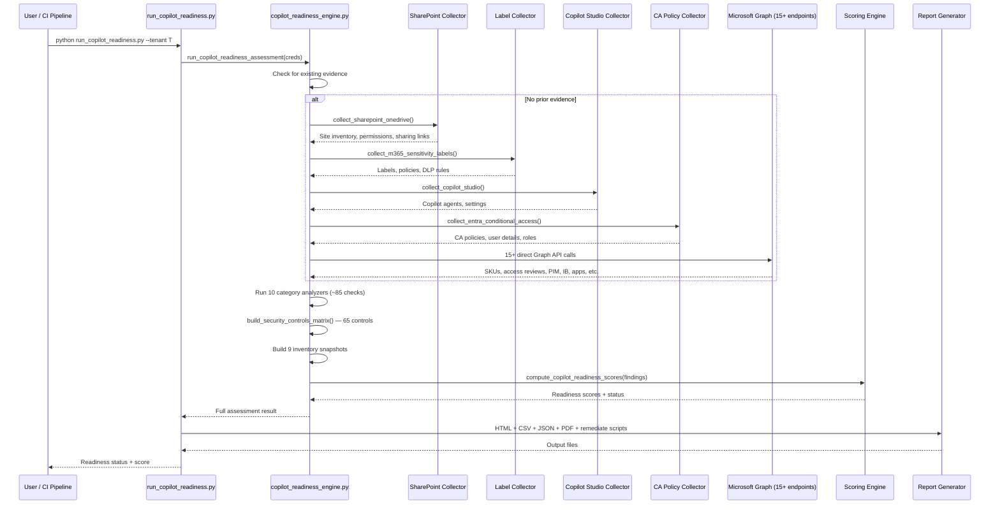

# M365 Copilot Readiness Engine — Deep Dive

> **Executive Summary** — Deep technical reference for the M365 Copilot Readiness Engine
> (`copilot_readiness_engine.py`, 5,489 lines). Evaluates 10 readiness categories with 85+ checks,
> a 65-control security matrix, and 80 effort-to-remediate mappings. The canonical Copilot readiness reference.
>
> | | |
> |---|---|
> | **Audience** | M365 administrators, Copilot deployment teams |
> | **Prerequisites** | [Architecture](architecture.md) for pipeline context |
> | **Companion docs** | [AI Agent Security](ai-agent-security-deep-dive.md) · [Data Security](data-security-deep-dive.md) |

## Overview
- 5,489 lines, purely functional (no classes)  
- Assesses organizational readiness for Microsoft 365 Copilot deployment
- 10 assessment categories, ~85 readiness checks
- 65 security controls in the readiness matrix
- Consumes 40+ evidence types from SharePoint, Entra ID, M365 compliance, and Microsoft Graph
- Produces readiness-scored findings with effort estimates (quick_win / moderate / major)

## Architecture

### Pipeline Flow
1. Evidence collection (reuse or targeted Graph API collection via _cr_collect)
2. Run 10 category analyzers in sequence
3. Build Security Controls Matrix (65 controls, PASS/FAIL with Microsoft Learn references)
4. Build inventory snapshots (9 inventory types)
5. Score readiness (inverted: 100 = fully ready)
6. Report generation (HTML, CSV, JSON, PDF, remediation scripts)

### Sequence Diagram


## Assessment Categories (10)

### 1. Oversharing Risk (11 checks)
Assesses SharePoint/OneDrive permission hygiene — the #1 Copilot risk surface.

| Check | Severity | What It Evaluates |
|-------|----------|-------------------|
| `unable_to_assess` | high | SPO API access not available |
| `partial_site_discovery` | medium | Limited site visibility due to permissions |
| `broad_site_membership` | high | Sites with >100 permission entries |
| `everyone_permissions` | critical | "Everyone" or "Everyone except external" groups on sites |
| `anonymous_link_exposure` | critical | Active anonymous sharing links |
| `external_sharing_posture` | high | Tenant-wide external sharing configuration |
| `no_sharepoint_advanced_management` | high | SAM (SharePoint Advanced Management) not licensed |
| `no_sam_restricted_access_control` | medium | Restricted Access Control not configured |
| `no_sam_site_lifecycle_policy` | medium | No site lifecycle policies for stale content |
| `no_sam_dag_reports` | medium | Data Access Governance reports not enabled |
| `high_permission_blast_radius` | critical | Permission blast radius score >500 |
| `external_sharing_risk_score` | high | Weighted sharing risk (anon×10 + external×5 + org×1) |

### 2. Sensitivity Label Coverage (7+ checks)
| Check | Severity | What It Evaluates |
|-------|----------|-------------------|
| `label_api_inaccessible` | high | Label APIs not accessible |
| `no_labels_defined` | critical | No sensitivity labels configured |
| `insufficient_labels` | high | Fewer than 3 labels defined |
| `no_mandatory_labeling` | high | No mandatory labeling policy |
| `no_auto_labeling` | medium | No auto-labeling policies |
| `low_site_label_coverage` | high | Sites with labels <80% |
| `no_default_label` | medium | No default label configured |
| `mandatory_labeling_incomplete_scope` | medium | Mandatory labeling not covering all workloads |
| `labels_without_encryption` | medium | Labels missing encryption settings |

### 3. DLP for Copilot (4 checks)
| Check | Severity | What It Evaluates |
|-------|----------|-------------------|
| `no_dlp_policies` | critical | No DLP policies exist |
| `no_label_based_dlp` | high | DLP not integrated with sensitivity labels |
| `incomplete_workload_coverage` | medium | DLP not covering all M365 workloads |
| `no_endpoint_dlp` | medium | No endpoint DLP for device protection |

### 4. Restricted SharePoint Search (2 checks)
| Check | Severity | What It Evaluates |
|-------|----------|-------------------|
| `rss_not_configured` | high | Restricted SharePoint Search (site-level) not enabled |
| `rcd_not_configured` | medium | Restricted Content Discoverability (content-level) not configured |

### 5. Data Access Governance (23 checks)
The largest category, covering identity, licensing, and access management:

Key checks: `no_copilot_ca_policy`, `no_copilot_license`, `copilot_licenses_unassigned`, `no_access_reviews`, `no_information_barriers`, `no_mfa_enforcement`, `no_pim_configured`, `stale_accounts_detected` (>90 days), `excessive_global_admins` (>5), `shared_accounts_detected`, `no_session_signin_frequency`, `mailbox_delegation_fullaccess`, `shared_mailbox_over_delegated` (>25 members), `disabled_users_with_copilot_license`, `no_app_protection_policies`, `hybrid_accounts_stale_sync`, `no_copilot_license_segmentation`

### 6. Content Lifecycle (4 checks)
| Check | Severity | What It Evaluates |
|-------|----------|-------------------|
| `stale_content_exposure` | high | Large amounts of stale SharePoint content |
| `retention_assessment_needed` | medium | No retention policies for Copilot-accessible content |
| `no_legal_hold_configured` | low | No eDiscovery legal holds |
| `no_m365_backup` | medium | M365 Backup not configured |

### 7. Audit & Monitoring (8 checks)
| Check | What It Evaluates |
|-------|-------------------|
| `audit_logging_unknown` | Unified audit log status unknown |
| `copilot_interaction_audit` | Copilot interaction logging not enabled |
| `no_alert_policies` | No security alert policies |
| `no_defender_cloud_apps` | Microsoft Defender for Cloud Apps not active |
| `no_copilot_usage_analytics` | No Copilot usage reporting |
| `copilot_audit_events_not_analyzed` | Copilot audit events not being reviewed |
| `no_prompt_pattern_monitoring` | No prompt monitoring for misuse |
| `copilot_security_incidents_detected` | Active Copilot-related security incidents |

### 8. Copilot-Specific Security (14+ checks)
| Check | What It Evaluates |
|-------|-------------------|
| `copilot_plugins_unrestricted` | No plugin usage restrictions |
| `data_residency_unverified` | Data residency settings not confirmed |
| `no_ediscovery_configured` | eDiscovery not available for Copilot content |
| `no_insider_risk_policies` | No Insider Risk Management policies |
| `no_communication_compliance` | No Communication Compliance for Copilot |
| `no_dspm_for_ai` | Data Security Posture Management for AI not enabled |
| `unmanaged_copilot_agents` | Shadow Copilot agents without governance |
| `agent_over_permissioned` | Agent with >5 app permissions |
| `no_regulatory_framework_mapping` | No compliance framework mapping |
| `no_agent_approval_workflow` | No approval workflow for new agents |
| `ungoverned_external_connectors` | External connectors without review |
| `no_prompt_guardrails` | No prompt safety guardrails |

### 9. Zero Trust (6 checks)
| Check | What It Evaluates |
|-------|-------------------|
| `no_continuous_access_evaluation` | CAE not enabled |
| `no_token_protection` | Token protection/binding not configured |
| `no_phishing_resistant_mfa` | No phishing-resistant MFA (FIDO2/WHfB) |
| `no_authentication_context` | Authentication contexts not used |
| `workload_identity_unprotected` | Workload identity CA not configured |
| `no_compliant_network_check` | No compliant network verification |

### 10. Shadow AI (6 checks)
| Check | What It Evaluates |
|-------|-------------------|
| `unauthorized_ai_apps_detected` | Non-approved AI apps (ChatGPT, Anthropic, etc.) in tenant |
| `ai_consent_grants_detected` | AI app consent grants with broad permissions |
| `shadow_copilot_agents_detected` | Unauthorized Copilot agents |
| `no_ai_app_governance` | No governance policy for AI apps |
| `ai_apps_overpermissioned` | AI apps with ≥3 app perms or ≥10 total |
| `no_ai_dlp_web_restrictions` | No DLP restrictions for web-based AI tools |

## Security Controls Matrix (65 controls)

The engine generates a structured PASS/FAIL matrix with Microsoft Learn reference URLs for each control. Used by the report generator to produce a compliance-style dashboard.

## Scoring Model

### Inverted Readiness Score
Unlike risk scores, readiness uses an inverted model:
- `readiness = max(0, 100 - min(100, raw_risk × 5))`
- 100 = Fully Ready, 0 = Critical Gaps

### Readiness Levels
| Score Range | Level |
|-------------|-------|
| ≥75 | Ready |
| ≥50 | Mostly Ready |
| ≥25 | Needs Work |
| <25 | Not Ready |

### Status Determination
- **NOT READY**: Any critical finding OR >2 high findings
- **NEEDS WORK**: Any high finding OR overall <75
- **READY**: Otherwise

### Effort Estimates
Each finding carries an effort tag: `quick_win`, `moderate`, or `major` (80 mappings in `_EFFORT_MAP`).

## Evidence Types (40+)

Key evidence types consumed:
| Evidence | Source | Used By |
|----------|--------|---------|
| `spo-site-inventory` | SharePoint collector | Oversharing, lifecycle, RSS |
| `spo-site-permissions` | SharePoint collector | Oversharing, blast radius |
| `spo-sharing-links` | SharePoint collector | Oversharing, sharing scorecard |
| `m365-subscribed-skus` | Graph API | Licensing, SAM detection, Copilot licensing |
| `m365-sensitivity-label-definition` | Label collector | Label inventory |
| `m365-dlp-policies` | Label collector | DLP checks |
| `entra-conditional-access-policy` | CA collector | CA, MFA, ZT checks |
| `entra-user-details` | CA collector | Stale accounts, shared accounts |
| `entra-directory-role-members` | CA collector | Excessive GA check |
| `entra-applications` | Graph API | Shadow AI, connector review |
| `m365-copilot-settings` | Copilot collector | Plugin restrictions, guardrails |
| `m365-copilot-agents` | Copilot collector | Shadow agents |
| `m365-copilot-audit-events` | Graph API | Audit analysis |

## CLI Usage

```bash
# Full assessment
python run_copilot_readiness.py --tenant <tenant-id>

# Reuse evidence
python run_copilot_readiness.py --tenant <tenant-id> --evidence raw-evidence.json

# Target specific categories
python run_copilot_readiness.py --tenant <tenant-id> --category oversharing,labels,dlp

# Trend comparison
python run_copilot_readiness.py --tenant <tenant-id> --previous-run prior-assessment.json

# CI/CD gate
python run_copilot_readiness.py --tenant <tenant-id> --fail-on-severity high
```

## Output Artifacts
| File | Content |
|------|---------|
| `copilot-readiness-assessment.json` | Full JSON results |
| `copilot-readiness-findings.csv` | Flat CSV findings |
| `copilot-readiness-report.html` | Interactive HTML dashboard |
| `remediate.ps1` / `remediate.sh` | Auto-generated remediation |
| `*.pdf` | PDF conversion |

## Key Thresholds
| Threshold | Value |
|-----------|-------|
| Broad membership | >100 permissions per site |
| Everyone group | >200 members |
| Blast radius | Score >500 |
| Stale accounts | >90 days inactive |
| Excessive GAs | >5 Global Admins |
| Shared mailbox delegation | >25 members |
| Insufficient labels | <3 defined |
| Site label coverage | <80% |
| AI app over-permissioned | ≥3 app perms or ≥10 total |
| AI keyword detection | 16 keywords (openai, chatgpt, anthropic, etc.) |

## Source Files
| File | Lines | Purpose |
|------|-------|---------|
| [`copilot_readiness_engine.py`](../AIAgent/app/copilot_readiness_engine.py) | 5,489 | Core engine — 10 categories, ~85 checks, 65-control matrix |
| [`run_copilot_readiness.py`](../AIAgent/run_copilot_readiness.py) | ~460 | CLI runner |
| [`copilot_readiness_report.py`](../AIAgent/app/reports/copilot_readiness_report.py) | 3,409 | HTML report generator |
