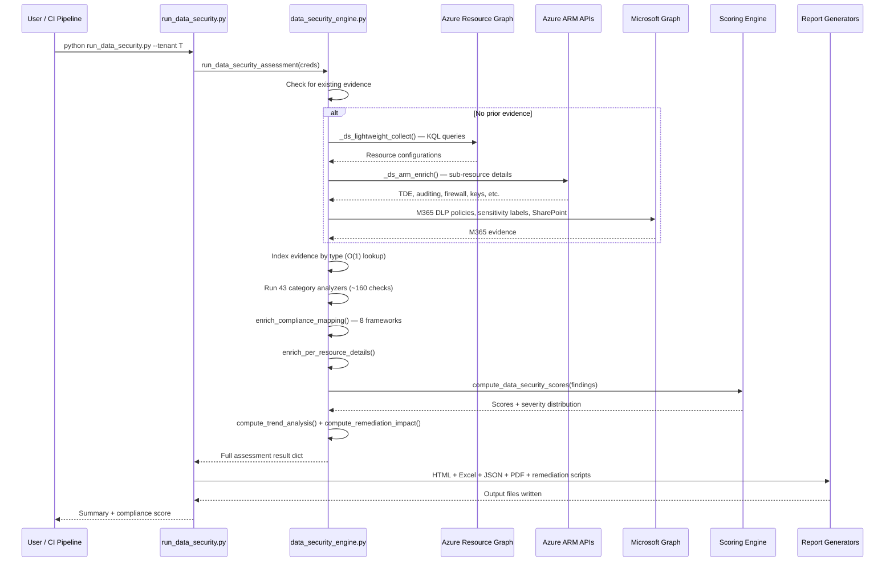

# Data Security Engine — Deep Dive

> **Executive Summary** — Deep technical reference for the Data Security Engine (`data_security_engine.py`, 9,904 lines).
> Covers 43 assessment categories, ~160 individual checks, 8 compliance framework mappings,
> and 7 report output formats. The canonical source for data security assessment logic.
>
> | | |
> |---|---|
> | **Audience** | Data security analysts, compliance engineers |
> | **Prerequisites** | [Architecture](architecture.md) for pipeline context |
> | **Companion docs** | [Evaluation Rules](evaluation-rules.md) · [Tenant Assessment](tenant-assessment-deep-dive.md) |

## Overview
- 9,904 lines, ~200 functions, purely functional (no classes)
- Analyzes data-layer security posture across Azure/M365 tenant
- 43 assessment categories, ~160 check functions
- Evidence-driven: consumes 40+ evidence types from ARG, ARM, and Microsoft Graph
- Produces severity-scored findings with remediation guidance and compliance framework mappings (8 frameworks)

## Architecture

### Pipeline Flow
1. Evidence collection (reuse from prior assessment or lightweight ARG/ARM collection)
2. Evidence indexing by type  
3. 43 category analyzers run in parallel
4. Findings enriched with compliance mappings (CIS, PCI-DSS v4.0.1, HIPAA, NIST-800-53 r5, ISO-27001:2022, SOC2, NIST-CSF 2.0, MCSB 1.0)
5. Per-resource detail enrichment
6. Scoring and trend analysis
7. Report generation (HTML, Excel, JSON, PDF, remediation scripts)

### Sequence Diagram (mermaid)


## Assessment Categories (43)

### Storage & Encryption (6 categories)
| # | Category | Key | Checks | What It Evaluates |
|---|----------|-----|--------|-------------------|
| 1 | Storage Exposure | `storage` | 16 | Blob public access, HTTPS, network rules, soft-delete, TLS, shared key, infrastructure encryption, anonymous containers, SAS policy, immutability, lifecycle, CORS, bypass, logging, versioning, change feed |
| 2 | Encryption Posture | `encryption` | 6 | Disk encryption (OS + data), storage CMK, encryption-at-host, managed disk CMK, Log Analytics CMK |
| 3 | Key Vault Hygiene | `keyvault` | 9 | Access policies count, purge protection, expiring items (30-day horizon), RBAC model, network restrictions, soft delete, no-expiry secrets, certificate auto-renewal, HSM-backed keys |
| 4 | Certificate Lifecycle | `cert_lifecycle` | — | Certificate expiration and renewal tracking |
| 5 | Secret Sprawl | `secret_sprawl` | — | Secrets embedded in App Service/Function App settings |
| 6 | Redis Security | `redis` | 5 | TLS, non-SSL port, firewall rules, patch schedule, public network access |

### Database Security (5 categories)
| # | Category | Key | Checks | What It Evaluates |
|---|----------|-----|--------|-------------------|
| 7 | Database Security | `database` | 10 | SQL TDE, auditing, advanced threat protection, firewall, Allow Azure Services, TDE key source, public access, DDM, RLS, AAD-only auth |
| 8 | Cosmos DB Security | `cosmosdb` | 6 | Public access, IP firewall, key-based auth, backup policy, CMK, consistency level |
| 9 | PostgreSQL/MySQL | `pgmysql` | 6 | SSL enforcement, public access, open firewall, geo-redundant backup, HA, AAD auth |
| 10 | SQL Managed Instance | `sql_mi` | — | SQL MI-specific security checks |
| 11 | Databricks Security | `databricks` | — | VNet injection, CMK, public access |

### Identity & Access (4 categories)
| # | Category | Key | Checks | What It Evaluates |
|---|----------|-----|--------|-------------------|
| 12 | Data Access Controls | `data_access` | 9 | Sensitive data tags, broad RBAC, Defender for Storage/SQL/KV, diagnostics, Owner/Contributor on data services, SP Key Vault access, managed identity adoption |
| 13 | Managed Identity Deep | `identity` | — | Broad MI audit across data service types |
| 14 | Stale Permissions | `stale_permissions` | — | Unused RBAC assignments on data resources |
| 15 | Conditional Access/PIM | `conditional_access` | — | Missing MFA policies, permanent PIM assignments |

### Network & Exposure (5 categories)
| # | Category | Key | Checks | What It Evaluates |
|---|----------|-----|--------|-------------------|
| 16 | Private Endpoints | `private_endpoints` | 3 | Missing private endpoints, pending approval PEs, AI services network exposure |
| 17 | Network Segmentation | `network_segmentation` | 5 | ADF managed VNet, Synapse managed VNet, NSG permissive data ports, DDoS protection, data subnet service endpoints |
| 18 | Data Exfiltration | `data_exfiltration` | — | Storage network bypass, cross-subscription PE, unrestricted NSG outbound |
| 19 | Firewall/AppGW | `firewall` | — | Firewall threat intel + IDPS mode, AppGW WAF |
| 20 | Bastion Security | `bastion` | — | Open RDP/SSH, shareable links |

### Data Governance (8 categories)
| # | Category | Key | Checks | What It Evaluates |
|---|----------|-----|--------|-------------------|
| 21 | Data Classification | `data_classification` | 8 | SQL sensitivity labels, vulnerability assessment, Defender SDD, Purview coverage, unclassified stores, SDD alerts, Purview scan results, auto-labeling |
| 22 | Purview Security | `purview` | 4 | Account existence, public access, managed identity, private endpoints |
| 23 | M365 DLP | `m365_dlp` | 6 | Policy existence, disabled policies, coverage gaps, notify-only actions, sensitive info types, rule effectiveness |
| 24 | DLP Alert Effectiveness | `dlp_alert` | 1 | DLP alert volume and false positive analysis |
| 25 | Data Residency | `data_residency` | 2 | Resource location compliance, geo-replication cross-boundary |
| 26 | SharePoint Governance | `sharepoint_governance` | 6 | Overshared sites, anonymous links, external sharing, stale sites, unlabeled sites, guest permissions |
| 27 | M365 Data Lifecycle | `m365_data_lifecycle` | 3 | Data minimization, retention labels, eDiscovery readiness |
| 28 | Data Flow | `data_flow` | — | Data movement topology mapping |

### Infrastructure Security (8 categories)
| # | Category | Key | Checks | What It Evaluates |
|---|----------|-----|--------|-------------------|
| 29 | Container Security | `container_security` | 6 | ACR admin access, vulnerability scanning, AKS RBAC, AKS network policy, quarantine policy, pod security standards |
| 30 | Messaging Security | `messaging` | 5 | EventHub network rules, ServiceBus network rules, TLS, local auth, capture encryption |
| 31 | AI Services Security | `ai_services` | 3 | Key auth disabled, managed identity, CMK |
| 32 | Data Factory/Synapse | `data_pipeline` | 5 | ADF public access, managed identity, git integration, Synapse public access, Synapse AAD-only |
| 33 | API Management | `apim` | — | VNet integration, managed identity |
| 34 | Front Door Security | `frontdoor` | — | WAF mode, minimum TLS |
| 35 | File Sync Security | `file_sync` | 5 | Service existence, public access, private endpoints, cloud tiering, stale registered servers (7-day heartbeat) |
| 36 | App Config Security | `app_config` | — | Public access, private endpoint, soft-delete |

### Resilience & Compliance (5 categories)
| # | Category | Key | Checks | What It Evaluates |
|---|----------|-----|--------|-------------------|
| 37 | Backup & DR | `backup_dr` | 6 | Resource locks, vault redundancy, unprotected VMs, SQL backup retention, Cosmos backup policy, vault CMK |
| 38 | Threat Detection | `threat_detection` | 4 | Immutable audit logs, Defender coverage gaps, alert action groups, audit log retention |
| 39 | Policy Compliance | `policy_compliance` | — | Azure Policy non-compliance for data resources |
| 40 | Defender Score | `defender_score` | — | Unhealthy Defender recommendations |
| 41 | Config Drift | `config_drift` | — | Security property changes over time |

### Advanced Analytics (2 categories)
| # | Category | Key | Checks | What It Evaluates |
|---|----------|-----|--------|-------------------|
| 42 | Blast Radius | `blast_radius` | — | Cross-resource impact analysis (returns topology, not findings) |
| 43 | Supply Chain Risk | `supply_chain` | — | Untrusted container registries, external packages with data access |

## Scoring Model

### Severity Weights
| Severity | Weight |
|----------|--------|
| Critical | 10.0 |
| High | 7.5 |
| Medium | 5.0 |
| Low | 2.5 |
| Informational | 1.0 |

### Score Calculation
- **Per-category score**: `min(100, sum(severity_weight) × 5)`
- **Overall score**: Weighted average of category scores (weighted by finding count per category)
- **Risk levels**: ≥75 → Critical, ≥50 → High, ≥25 → Medium, <25 → Low

### Output Includes
- `OverallScore` and `OverallLevel`
- `CategoryScores` with per-category breakdown
- `SeverityDistribution` (critical/high/medium/low/informational counts)
- `TopFindings` (top 10 by severity)
- `RemediationImpact` (estimated score improvement per remediation)
- `TrendAnalysis` (multi-run comparison)

## Evidence Types (40+)

The engine consumes evidence indexed by type key. Key evidence types:

| Evidence Key | Source | Used By |
|---|---|---|
| `azure-storage-security` | ARG + ARM | Storage, encryption |
| `azure-storage-containers` | ARG | Storage (anonymous access) |
| `azure-sql-server` | ARG + ARM | Database, classification |
| `azure-cosmosdb` | ARG + ARM | Cosmos DB |
| `azure-keyvault` | ARG + ARM | Key Vault hygiene |
| `azure-compute-instance` | ARG + ARM | Encryption |
| `azure-managed-disk` | ARG | Encryption, backup |
| `azure-role-assignments` | ARM | Data access, stale perms |
| `azure-defender-plans` | ARM | Threat detection, Defender |
| `azure-private-endpoint-connections` | ARM | Private endpoints |
| `azure-nsg` | ARG | Network segmentation |
| `azure-recovery-vault` | ARG + ARM | Backup/DR |
| `azure-policy-states` | ARM | Policy compliance |
| `azure-aks` | ARG + ARM | Container security |
| `azure-containerregistry` | ARG + ARM | Container security |
| `azure-redis` | ARG + ARM | Redis security |
| `azure-eventhub` / `azure-servicebus` | ARG + ARM | Messaging |
| `azure-datafactory` / `azure-synapse` | ARG + ARM | Data pipeline |
| `m365-dlp-policies` | Graph | M365 DLP |
| `m365-sensitivity-label-definition` | Graph | Classification |
| `m365-sharepoint-sites` | Graph | SharePoint governance |
| `m365-retention-labels` | Graph | M365 lifecycle |

## Compliance Mapping

Each finding is enriched with control IDs from 8 compliance frameworks:

| Framework | Example Controls |
|-----------|-----------------|
| CIS Azure Benchmark | 3.1, 4.1.1, 7.1 |
| PCI-DSS v4.0.1 | 3.4.1, 6.2.4 |
| HIPAA | 164.312(a)(1), 164.312(e)(1) |
| NIST 800-53 r5 | SC-28, SC-13, AC-6 |
| ISO 27001:2022 | A.8.24, A.8.10 |
| SOC 2 | CC6.1, CC6.7 |
| NIST CSF 2.0 | PR.DS-01, DE.CM-01 |
| MCSB 1.0 | DP-1, DP-4 |

## Finding Format

Each finding includes:
```
DataSecurityFindingId    — deterministic UUID5 from fingerprint
Category                 — one of 43 category keys
Subcategory              — specific check identifier
Title                    — human-readable finding title
Description              — detailed explanation
Severity                 — critical | high | medium | low | informational
AffectedResources        — list of {Type, Name, ResourceId, ...}
AffectedCount            — number of affected resources
Remediation              — {Description, AzureCLI, PowerShell, PortalSteps}
ComplianceMapping        — {framework: [control_ids]} (after enrichment)
PerResourceDetails       — per-resource risk/remediation (after enrichment)
DetectedAt               — ISO 8601 timestamp
```

## CLI Usage

```bash
# Full assessment
python run_data_security.py --tenant <tenant-id>

# Reuse evidence from prior assessment
python run_data_security.py --tenant <tenant-id> --evidence output/<date>/raw-evidence.json

# Target specific categories
python run_data_security.py --tenant <tenant-id> --category storage,database,keyvault

# Compare with previous run (trend analysis)
python run_data_security.py --tenant <tenant-id> --previous-run output/<date>/data-security-assessment.json

# Apply suppressions (accepted risks)
python run_data_security.py --tenant <tenant-id> --suppressions suppressions.json

# CI/CD gate (exit non-zero if threshold exceeded)
python run_data_security.py --tenant <tenant-id> --fail-on-severity high

# List all 43 categories
python run_data_security.py --list-categories

# Select output formats
python run_data_security.py --tenant <tenant-id> --format json,html,excel,brief,scripts
```

### CLI Arguments
| Flag | Required | Description |
|------|----------|-------------|
| `--tenant` | Yes | Azure AD tenant ID |
| `--evidence` | No | Path to pre-collected raw-evidence.json |
| `--category` | No | Comma-separated category filter (43 categories) |
| `--previous-run` | No | Path to previous JSON for trend comparison |
| `--suppressions` | No | Path to suppressions.json |
| `--fail-on-severity` | No | CI/CD gate threshold |
| `--output-dir` | No | Custom output path |
| `--format` | No | Comma-separated: json, html, excel, brief, scripts |
| `--list-categories` | No | Print all 43 categories and exit |
| `--quiet` / `-q` | No | Suppress console output |
| `--verbose` / `-v` | No | DEBUG-level logging |

## Output Artifacts

| File | Format | Content |
|------|--------|---------|
| `data-security-assessment.json` | JSON | Full assessment results |
| `data-security-report.html` | HTML | Interactive dashboard with charts |
| `data-security-report.xlsx` | Excel | Tabular finding export |
| `executive-brief.html` | HTML | Executive summary |
| `cost-methodology-report.html` | HTML | Cost methodology documentation |
| `remediate.ps1` | PowerShell | Auto-generated remediation script |
| `remediate.sh` | Bash | Auto-generated remediation script |
| `*.pdf` | PDF | Converted from all HTML reports |

## Integration Points

| Module | Purpose |
|--------|---------|
| `app.auth.ComplianceCredentials` | Azure/Graph authentication |
| `app.reports.data_security_report` | HTML + Excel + executive brief + cost methodology |
| `app.reports.pdf_export` | PDF conversion |
| `app.logger` | Shared structured logging |

## Key Thresholds

| Threshold | Value | Purpose |
|-----------|-------|---------|
| KV expiry horizon | 30 days | "Expiring soon" for Key Vault items |
| KV access policy count | >10 | "Excessive" access policies |
| File Sync heartbeat | 7 days | Stale registered servers |
| Score → level | 75/50/25 | Risk level classification |

## Source Files

| File | Lines | Purpose |
|------|-------|---------|
| [`data_security_engine.py`](../AIAgent/app/data_security_engine.py) | 9,904 | Core engine — 43 analyzers, ~160 checks, scoring, enrichment |
| [`run_data_security.py`](../AIAgent/run_data_security.py) | ~600 | CLI runner with suppression, trend, CI/CD gate |
| [`data-security-relevance.json`](../config/data-security-relevance.json) | — | Category relevance explanations (43 entries) |
| [`data_security_report.py`](../AIAgent/app/reports/data_security_report.py) | 3,348 | HTML report generator |
