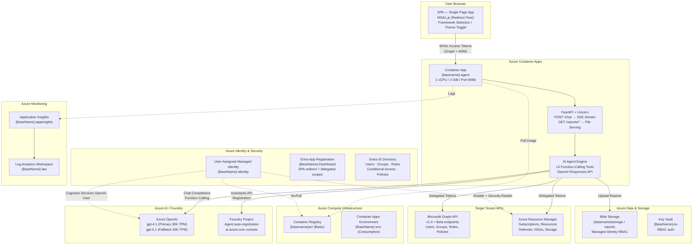

# PostureIQ — Infrastructure Blueprint & Repeatable Deployment

Complete reference for replicating the PostureIQ infrastructure on any Azure tenant.
Covers every Azure resource, configuration, RBAC role, environment variable, and the
automated script that provisions everything end-to-end.

**Author:** Murali Chillakuru
**Last updated:** April 13, 2026

---

## Table of Contents

1. [Quick Start](#1-quick-start)
2. [Architecture Diagram](#2-architecture-diagram)
3. [Azure Resource Inventory](#3-azure-resource-inventory)
4. [Automated Deployment Script](#4-automated-deployment-script)
5. [App Registration (Entra ID)](#5-app-registration-entra-id)
6. [Managed Identity & RBAC Roles](#6-managed-identity--rbac-roles)
7. [Azure OpenAI & Foundry](#7-azure-openai--foundry)
8. [Storage Configuration](#8-storage-configuration)
9. [Container App Configuration](#9-container-app-configuration)
10. [Environment Variables Reference](#10-environment-variables-reference)
11. [SPA / MSAL Configuration](#11-spa--msal-configuration)
12. [Agent Capabilities (12 Tools)](#12-agent-capabilities-12-tools)
13. [Compliance Frameworks (11)](#13-compliance-frameworks-11)
14. [Report Outputs & File Naming](#14-report-outputs--file-naming)
15. [Token Usage & Cost Tracking](#15-token-usage--cost-tracking)
16. [Monitoring & Observability](#16-monitoring--observability)
17. [Build & Deploy Commands](#17-build--deploy-commands)
18. [Post-Deployment: Manual Entra Roles](#18-post-deployment-manual-entra-roles)
19. [Monthly Cost Estimate](#19-monthly-cost-estimate)
20. [Troubleshooting](#20-troubleshooting)

---

## 1. Quick Start

```powershell
# Clone the repository
git clone https://github.com/<org>/EnterpriseSecurityIQ.git
cd EnterpriseSecurityIQ

# Login to Azure
az login
az account set --subscription "<your-subscription>"

# Deploy everything (16 idempotent steps)
.\Infra-Foundary-New\deploy.ps1 `
    -BaseName "MyESIQ" `
    -Location "eastus2" `
    -SubscriptionName "Production"
```

The script creates **all 14 Azure resources**, builds the Docker image, deploys the
container app, creates the Entra app registration, and patches the SPA config.

The only manual step is assigning Entra directory roles (requires Global Admin) — see
[Section 18](#18-post-deployment-manual-entra-roles).

---

## 2. Architecture Diagram



---

## 3. Azure Resource Inventory

All resources use the `{BaseName}` prefix (default: `ESIQNew`).

| # | Resource | Azure Type | Name Pattern | SKU / Tier | Purpose |
|---|----------|-----------|-------------|-----------|---------|
| 1 | Resource Group | `Microsoft.Resources/resourceGroups` | `{BaseName}-RG` | — | Logical container |
| 2 | Foundry Resource | `Microsoft.CognitiveServices/accounts` (kind: AIServices) | `{BaseName}-AI` | S0 | Azure OpenAI + Foundry hub |
| 3 | Foundry Project | `Microsoft.CognitiveServices/accounts/projects` | `{BaseName}-AI/{BaseName}-project` | — | ai.azure.com project |
| 4 | Primary Model | Model Deployment | `gpt-4.1` | Standard 30K TPM | Agent reasoning + tool calls |
| 5 | Fallback Model | Model Deployment | `gpt-5.1` | Standard 30K TPM | Complex tasks |
| 6 | Storage Account | `Microsoft.Storage/storageAccounts` | `{basename}storage` | Standard_LRS | Report blob persistence |
| 7 | Key Vault | `Microsoft.KeyVault/vaults` | `{BaseName}-kv` | Standard (RBAC) | Secrets management |
| 8 | Log Analytics | `Microsoft.OperationalInsights/workspaces` | `{BaseName}-law` | PerGB2018 | Log aggregation |
| 9 | App Insights | `Microsoft.Insights/components` | `{BaseName}-appinsights` | Workspace-based | Telemetry |
| 10 | Container Registry | `Microsoft.ContainerRegistry/registries` | `{basename}acr` | Basic | Docker image hosting |
| 11 | Managed Identity | `Microsoft.ManagedIdentity/userAssignedIdentities` | `{BaseName}-identity` | — | Passwordless auth to Azure |
| 12 | Container Apps Env | `Microsoft.App/managedEnvironments` | `{BaseName}-env` | Consumption | Serverless hosting |
| 13 | Container App | `Microsoft.App/containerApps` | `{basename}-agent` | 1 vCPU / 2 GiB | Runs agent + SPA |
| 14 | App Registration | `Microsoft.Graph/applications` | `{BaseName}-Dashboard` | — | MSAL SPA auth |

---

## 4. Automated Deployment Script

**File:** `Infra-Foundary-New/deploy.ps1`

### Parameters

| Parameter | Default | Description |
|-----------|---------|-------------|
| `-BaseName` | `ESIQNew` | Prefix for all resource names (must be globally unique for ACR/Storage) |
| `-Location` | `swedencentral` | Azure region (must support OpenAI models) |
| `-SubscriptionName` | `AI` | Azure subscription name |
| `-PrimaryModel` | `gpt-4.1` | Primary model deployment name |
| `-FallbackModel` | `gpt-5.1` | Fallback model deployment name |
| `-ModelSku` | `Standard` | Model SKU (Standard, GlobalStandard, ProvisionedManaged) |
| `-ModelCapacity` | `30` | TPM capacity in thousands |
| `-TenantId` | auto-detect | Entra tenant ID (auto from `az account show`) |

### 16 Steps (Idempotent)

| Step | Action | Created Resource |
|------|--------|-----------------|
| 1 | Create Resource Group | `{BaseName}-RG` |
| 2 | Create Foundry Resource (+ custom domain, allowProjectManagement) | `{BaseName}-AI` |
| 3 | Create Foundry Project (ARM REST API) | `{BaseName}-project` |
| 4 | Deploy primary model | `gpt-4.1` |
| 5 | Deploy fallback model | `gpt-5.1` |
| 6 | Create Storage Account | `{basename}storage` |
| 7 | Create Key Vault (RBAC auth) | `{BaseName}-kv` |
| 8 | Create Log Analytics Workspace | `{BaseName}-law` |
| 9 | Create Application Insights | `{BaseName}-appinsights` |
| 10 | Create Container Registry | `{basename}acr` |
| 11 | Create Managed Identity | `{BaseName}-identity` |
| 12 | Assign 5 RBAC roles | AcrPull, Reader, Security Reader, OpenAI User, AI Developer |
| 13 | Create Container Apps Environment | `{BaseName}-env` |
| 14 | Build Docker image + Create/Update Container App | `{basename}-agent` |
| 15 | Create Entra App Registration + set redirect URIs | `{BaseName}-Dashboard` |
| 16 | Patch `webapp/index.html` with client ID + rebuild image | — |

### Example: Deploy to Another Tenant

```powershell
# New deployment for a different client
.\Infra-Foundary-New\deploy.ps1 `
    -BaseName "ClientABC" `
    -Location "westeurope" `
    -SubscriptionName "Client ABC Subscription" `
    -TenantId "xxxxxxxx-xxxx-xxxx-xxxx-xxxxxxxxxxxx"
```

This creates: `ClientABC-RG`, `ClientABC-AI`, `clientabcstorage`, `clientabcacr`,
`clientabc-agent`, etc. — fully isolated from other deployments.

### Quick Rebuild (Image Only)

```powershell
.\Infra-Foundary-New\redeploy-image.ps1
```

---

## 5. App Registration (Entra ID)

Created automatically by `deploy.ps1` Step 15. Manual setup if needed:

### Configuration

| Setting | Value |
|---------|-------|
| Display Name | `{BaseName}-Dashboard` |
| Supported Account Types | Single tenant (`AzureADMyOrg`) |
| Platform | Single-Page Application (SPA) |
| Redirect URIs | `https://{container-app-fqdn}`, `http://localhost:8080` |
| ID Tokens | Enabled |
| Access Tokens | Enabled |

### Delegated API Permissions

| Permission | Type | Requires Admin Consent |
|------------|------|----------------------|
| `User.Read` | Delegated | No |
| `Directory.Read.All` | Delegated | **Yes** |
| `Policy.Read.All` | Delegated | **Yes** |
| `RoleManagement.Read.All` | Delegated | **Yes** |

> **Important:** An Entra admin must grant admin consent via the portal.

### Output Values

| Value | Usage |
|-------|-------|
| **Application (client) ID** | `MSAL_CONFIG.auth.clientId` in `webapp/index.html` |

---

## 6. Managed Identity & RBAC Roles

### Managed Identity

| Property | Value |
|----------|-------|
| Type | User-Assigned |
| Name | `{BaseName}-identity` |
| Assigned to | Container App ({basename}-agent) |

### Azure RBAC Roles (Assigned by deploy.ps1 Step 12)

| # | Role | Scope | Purpose |
|---|------|-------|---------|
| 1 | `AcrPull` | Container Registry | Pull Docker images |
| 2 | `Reader` | Subscription | Read Azure resources for compliance checks |
| 3 | `Security Reader` | Subscription | Read Microsoft Defender posture data |
| 4 | `Cognitive Services OpenAI User` | Foundry Resource | Call Azure OpenAI API |
| 5 | `Azure AI Developer` | Foundry Resource | Register/manage Foundry agents |

### Additional Roles for Full Functionality

| Role | Scope | Purpose |
|------|-------|---------|
| `Storage Blob Data Contributor` | Storage Account | Upload/read report blobs |
| `Key Vault Secrets User` | Key Vault | Read secrets (if used) |

---

## 7. Azure OpenAI & Foundry

### Model Deployments

| Deployment Name | Model | API Version | SKU | Capacity | Purpose |
|----------------|-------|-------------|-----|----------|---------|
| `gpt-4.1` | gpt-4.1 | 2025-04-14 | Standard | 30K TPM | Primary — agent reasoning, tool calls, summarization |
| `gpt-5.1` | gpt-5.1 | 2025-11-13 | Standard | 30K TPM | Fallback — higher complexity |

### Foundry Integration

The agent auto-registers with Foundry on startup using the Assistants API:
- Scans existing assistants for name `EnterpriseSecurityIQ`
- Creates one if not found
- Registers all 14 tool schemas
- Visible in [ai.azure.com](https://ai.azure.com) under the project

---

## 8. Storage Configuration

| Setting | Value |
|---------|-------|
| Account Name | `{basename}storage` |
| Container | `reports` |
| Tier | Standard_LRS |
| Access | Managed Identity (DefaultAzureCredential) |
| TLS | 1.2 minimum |

### Report Flow

1. Agent generates reports to `/agent/output/{timestamp}/{type}/`
2. Uploaded to `reports` blob container immediately after generation
3. `/reports/{path}` API endpoint serves from local cache
4. Falls back to blob download if local file doesn't exist (e.g., after container restart)

---

## 9. Container App Configuration

| Setting | Value |
|---------|-------|
| Image | `{basename}acr.azurecr.io/{basename}-agent:v{N}` |
| CPU / Memory | 1 vCPU / 2 GiB |
| Port | 8088 (HTTP) |
| Ingress | External (auto HTTPS) |
| Min Replicas | 0 (scale to zero for cost savings) |
| Max Replicas | 3 |
| Registry Auth | Managed Identity (AcrPull role) |
| FQDN | `{basename}-agent.{hash}.{region}.azurecontainerapps.io` |

### Dockerfile

```dockerfile
FROM python:3.12-slim
WORKDIR /agent
COPY AIAgent/requirements.txt .
RUN pip install --no-cache-dir --pre -r requirements.txt
RUN playwright install --with-deps chromium   # PDF generation
COPY AIAgent/app/ app/
COPY AIAgent/main.py .
COPY webapp/ webapp/
EXPOSE 8088
CMD ["uvicorn", "app.api:app", "--host", "0.0.0.0", "--port", "8088"]
```

### API Endpoints

| Method | Path | Purpose |
|--------|------|---------|
| GET | `/` | Serve SPA (`webapp/index.html`) |
| POST | `/chat` | Agent chat with function calling → SSE stream |
| POST | `/assessments` | Start background assessment (returns task_id) |
| GET | `/assessments/{id}` | Poll assessment status |
| GET | `/health` | Health check + agent registration status |
| GET | `/reports` | List all generated report files |
| GET | `/reports/{path}` | Download specific report file |

---

## 10. Environment Variables Reference

### Required (Set by deploy.ps1)

| Variable | Example | Description |
|----------|---------|-------------|
| `AZURE_OPENAI_ENDPOINT` | `https://esiqnew-ai.cognitiveservices.azure.com/` | Azure OpenAI endpoint URL |
| `AZURE_OPENAI_DEPLOYMENT` | `gpt-4.1` | Primary model deployment name |
| `AZURE_OPENAI_API_VERSION` | `2025-01-01-preview` | OpenAI API version |
| `AZURE_CLIENT_ID` | `d5d10273-4a8b-...` | Managed identity client ID |
| `AZURE_TENANT_ID` | `4a3eb5f4-1ec6-...` | Target Entra tenant ID |

### Optional

| Variable | Default | Description |
|----------|---------|-------------|
| `AZURE_OPENAI_FALLBACK_DEPLOYMENT` | `gpt-5.1` | Fallback model |
| `FOUNDRY_PROJECT_ENDPOINT` | — | Foundry project endpoint |
| `REPORT_STORAGE_ACCOUNT` | `esiqnewstorage` | Blob storage account |
| `REPORT_STORAGE_CONTAINER` | `reports` | Blob container name |
| `ENTERPRISESECURITYIQ_CONFIG` | — | Path to config JSON |
| `ENTERPRISESECURITYIQ_AUTH_MODE` | `auto` | Auth mode: auto / serviceprincipal / appregistration / azurecli |
| `ENTERPRISESECURITYIQ_FRAMEWORKS` | (all) | Comma-separated framework list |
| `ENTERPRISESECURITYIQ_LOG_LEVEL` | `INFO` | Log verbosity |
| `AZURE_SUBSCRIPTION_FILTER` | — | Comma-separated subscription IDs |
| `TOKEN_COST_INPUT_PER_M` | `2.00` | Cost per 1M input tokens (USD) |
| `TOKEN_COST_OUTPUT_PER_M` | `8.00` | Cost per 1M output tokens (USD) |

---

## 11. SPA / MSAL Configuration

### MSAL Config (in `webapp/index.html`)

```javascript
const MSAL_CONFIG = {
  auth: {
    clientId: "<app-registration-client-id>",
    authority: "https://login.microsoftonline.com/common",
    redirectUri: window.location.origin,
  },
  cache: { cacheLocation: "sessionStorage" }
};
```

### Scopes

| Scope | Purpose |
|-------|---------|
| `User.Read` | Read signed-in user profile |
| `Directory.Read.All` | Enumerate users, groups, directory roles |
| `Policy.Read.All` | Read conditional access policies |
| `RoleManagement.Read.All` | Read Entra role assignments |
| `https://management.azure.com/user_impersonation` | Azure Resource Manager access |

### SPA Features

| Feature | Description |
|---------|-------------|
| Dark/Light theme | Toggle in header, CSS variables |
| Framework sidebar | 11 checkboxes, "Run Selected" button |
| Tenant switch | Modal to enter tenant GUID |
| Page width | Compact (860px) / Wide (1200px) / Full |
| Stop button | Abort in-progress requests |
| Report table | Framework × Format grid with View/Download |
| ZIP download | All reports bundled |
| Token badge | Shows prompt/completion tokens + estimated cost |

---

## 12. Agent Capabilities (14 Tools)

| # | Tool Function | Description | Output Formats |
|---|--------------|-------------|----------------|
| 1 | `run_postureiq_assessment` | Multi-framework compliance assessment | HTML, PDF, Excel, JSON, SARIF |
| 2 | `query_results` | Natural language Q&A over cached results | Text |
| 3 | `search_tenant` | KQL + NL resource/Entra search | Text |
| 4 | `analyze_risk` | Security risk gap analysis (5 categories) | HTML, PDF, Excel, JSON |
| 5 | `assess_data_security` | Data-layer security audit (7 categories) | HTML, PDF, Excel, JSON |
| 6 | `generate_rbac_report` | RBAC tree with PIM & risk analysis | HTML, JSON |
| 7 | `generate_report` | HTML/JSON compliance report generation | HTML, JSON |
| 8 | `assess_copilot_readiness` | M365 Copilot Premium readiness assessment | HTML, PDF, Excel, JSON |
| 9 | `assess_ai_agent_security` | Copilot Studio + Foundry security audit | HTML, PDF, Excel, JSON |
| 10 | `check_permissions` | Pre-flight permission validation | Text |
| 11 | `compare_runs` | Delta analysis across assessment runs | Text |
| 12 | `search_exposure` | Public storage, open NSGs, unencrypted resources | Text |
| 13 | `generate_custom_report` | Custom report generation across domains | HTML, PDF, Excel, JSON |
| 14 | `query_assessment_history` | Query and compare historical assessment data | Text |

### Authentication Modes

| Mode | Credential | When Used |
|------|-----------|-----------|
| User-delegated | Graph + ARM tokens from SPA MSAL | SPA `/chat` endpoint |
| Managed Identity | DefaultAzureCredential | Background tasks, Foundry registration |
| Service Principal | ClientSecretCredential | CI/CD automation |
| Azure CLI | AzureCliCredential | Local development |

---

## 13. Compliance Frameworks (11)

| Code | Full Name |
|------|-----------|
| `FedRAMP` | Federal Risk and Authorization Management Program |
| `CIS` | Center for Internet Security Benchmarks |
| `ISO-27001` | Information Security Management Systems |
| `NIST-800-53` | Security and Privacy Controls for Information Systems |
| `PCI-DSS` | Payment Card Industry Data Security Standard |
| `MCSB` | Microsoft Cloud Security Benchmark |
| `HIPAA` | Health Insurance Portability and Accountability Act |
| `SOC2` | System and Organization Controls 2 |
| `GDPR` | General Data Protection Regulation |
| `NIST-CSF` | NIST Cybersecurity Framework |
| `CSA-CCM` | Cloud Security Alliance Cloud Controls Matrix |

Framework control mappings: `AIAgent/app/frameworks/{framework}-mappings.json`

---

## 14. Report Outputs & File Naming

### Compliance Assessment Reports

| Framework | Subfolder | HTML | PDF | Excel | JSON |
|-----------|-----------|------|-----|-------|------|
| FedRAMP | `FedRAMP/` | `fedramp-compliance-report.html` | `fedramp-compliance-report.pdf` | `fedramp-report.xlsx` | (in data exports) |
| CIS | `CIS/` | `cis-compliance-report.html` | `cis-compliance-report.pdf` | `cis-report.xlsx` | |
| (pattern) | `{fw}/` | `{fw}-compliance-report.html` | `{fw}-compliance-report.pdf` | `{fw}-report.xlsx` | |

### Other Assessment Reports

| Assessment | Folder | Files |
|-----------|--------|-------|
| Risk Analysis | `Risk-Analysis/` | `risk-analysis.{html,pdf,xlsx,json}` |
| Data Security | `Data-Security/` | `data-security-assessment.{html,pdf,xlsx,json}` |
| Copilot Readiness | `Copilot-Readiness/` | `copilot-readiness-assessment.{html,pdf,xlsx,json}` |
| AI Agent Security | `AI-Agent-Security/` | `ai-agent-security-assessment.{html,pdf,xlsx,json}` |
| RBAC Report | `RBAC-Report/` | `rbac-tree.{html,json}` |

### Shared Files (Root)

| File | Purpose |
|------|---------|
| `compliance-data.json` | Raw assessment data export |
| `findings.json` | All findings in structured JSON |
| `sarif-report.sarif` | SARIF format for IDE integration |
| `remediation-playbooks.json` | Auto-generated remediation steps |
| `all-compliance-reports.zip` | ZIP bundle of all files |

---

## 15. Token Usage & Cost Tracking

Each chat request shows token consumption and estimated cost in the SPA.

### How It Works

1. Backend (`api.py`) accumulates `response.usage` across all LLM round-trips per chat
2. Emits `{type: "token_usage", prompt_tokens, completion_tokens, total_tokens, estimated_cost_usd, model}` SSE event
3. SPA renders a token badge below the agent's response

### Pricing (Configurable)

| Model | Input Cost (per 1M tokens) | Output Cost (per 1M tokens) |
|-------|---------------------------|----------------------------|
| gpt-4.1 | $2.00 | $8.00 |
| gpt-5.1 | $2.00 | $10.00 |

Override via environment variables: `TOKEN_COST_INPUT_PER_M`, `TOKEN_COST_OUTPUT_PER_M`.

### Typical Token Usage

| Action | Tokens | Estimated Cost |
|--------|--------|---------------|
| Simple question | 500–2,000 | < $0.01 |
| Single-framework assessment | 5,000–10,000 | $0.01–$0.05 |
| All-frameworks assessment | 10,000–20,000 | $0.05–$0.15 |
| Risk + Data Security + Copilot | 15,000–30,000 | $0.10–$0.25 |

---

## 16. Monitoring & Observability

### Application Insights

| Metric | What's Tracked |
|--------|---------------|
| Request duration | Time per `/chat` SSE session |
| Dependency calls | Azure OpenAI, Graph API, ARM API |
| Exceptions | Tool errors, authentication failures |
| Custom events | Tool invocations, assessment completions |

### Log Analytics (KQL)

```kql
// Find slow tool invocations
ContainerAppConsoleLogs_CL
| where Log_s contains "Phase 2 complete"
| project TimeGenerated, Log_s
| order by TimeGenerated desc
| take 20
```

### Container Logs (CLI)

```powershell
az containerapp logs show --name esiqnew-agent --resource-group ESIQNew-RG --type console --tail 50
```

---

## 17. Build & Deploy Commands

### Build Image

```powershell
cd EnterpriseSecurityIQ
az acr build --registry {basename}acr `
    --image {basename}-agent:v{N} `
    --file AIAgent/Dockerfile . `
    --no-logs `
    --build-arg CACHEBUST=$(Get-Date -Format 'yyyyMMddHHmmss')
```

### Deploy Image

```powershell
az containerapp update `
    --name {basename}-agent `
    --resource-group {BaseName}-RG `
    --image {basename}acr.azurecr.io/{basename}-agent:v{N} `
    -o table
```

### Health Check

```powershell
curl -s "https://{fqdn}/health" | python -m json.tool
# {"status": "ok", "agent_registered": true, "agent_id": "asst_..."}
```

### Git Workflow

```powershell
git add -A
git commit -m "v{N}: <description>"
git push
```

---

## 18. Post-Deployment: Manual Entra Roles

After `deploy.ps1` completes, a **Global Administrator** must assign these
directory roles to the managed identity.

### Steps

1. Go to [entra.microsoft.com](https://entra.microsoft.com)
2. Navigate to **Identity → Roles & admins**
3. For each role below, click the role → **Add assignments** → search for `{BaseName}-identity`

| Role | Purpose | Required |
|------|---------|----------|
| `Directory Readers` | Read users, groups, service principals | **Yes** |
| `Global Reader` | Read all Entra configuration (CA policies, etc.) | Recommended |
| `Security Reader` | Read security-related Entra data | Recommended |

> Without these roles, the agent can still assess Azure resources via ARM, but
> Entra ID compliance checks will return partial/empty results.

---

## 19. Monthly Cost Estimate

For a lightly-used deployment (< 50 assessments/month):

| Resource | SKU | Est. Monthly (USD) |
|----------|-----|-------------------|
| Azure OpenAI (gpt-4.1) | Standard 30K TPM | $5–30 (pay-per-token) |
| Container App | Consumption (scale to zero) | $0–15 |
| Container Registry | Basic | ~$5 |
| Storage Account | Standard LRS | < $1 |
| Key Vault | Standard | < $1 |
| Application Insights | Per-GB ingestion | $2–5 |
| Log Analytics | PerGB2018 | $2–5 |
| Managed Identity | — | **Free** |
| App Registration | — | **Free** |
| **Total** | | **~$15–60/month** |

> With scale-to-zero on the container app and pay-per-token on OpenAI,
> inactive periods cost near $0.

---

## 20. Troubleshooting

| Problem | Diagnosis | Fix |
|---------|-----------|-----|
| Container won't start | `az containerapp logs show --tail 100` | Check env vars, image tag |
| Agent not registered | `/health` shows `agent_registered: false` | Verify `AZURE_OPENAI_ENDPOINT` and MI roles |
| Assessment returns partial results | Missing Entra roles | Assign Directory Readers + Global Reader |
| SPA login fails | MSAL error in browser console | Check clientId, redirect URIs, admin consent |
| Reports lost after restart | Missing blob storage config | Set `REPORT_STORAGE_ACCOUNT` env var |
| 504 gateway timeout | Long assessment with Envoy timeout | Keepalives already configured (15s) |
| Token usage shows 0 | Older API version | Ensure `AZURE_OPENAI_API_VERSION=2025-01-01-preview` |
| Permission denied on Graph | User hasn't consented | Admin consent for Directory.Read.All |
