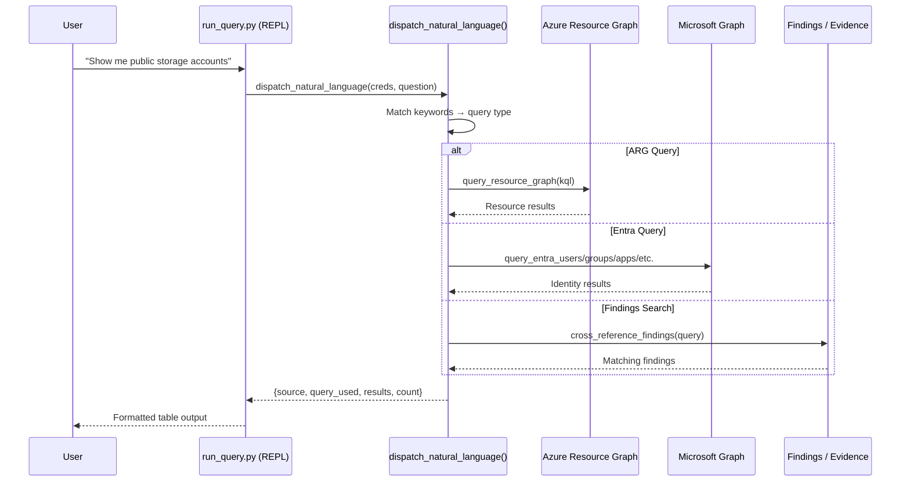

# Query Engine — Deep Dive

> **Executive Summary** — Deep technical reference for the Query Engine
> (`query_engine.py`, 1,070 lines). Provides 11 Azure Resource Graph (KQL) templates,
> 6 Entra ID queries, natural-language dispatch (8 NL patterns), evidence search, and
> an interactive REPL with 9 commands.
>
> | | |
> |---|---|
> | **Audience** | Security analysts, infrastructure engineers |
> | **Prerequisites** | [Architecture](architecture.md) for pipeline context |
> | **Companion docs** | [Usage Guide](PROMPTS.md) for CLI invocation · [Agent Capabilities](agent-capabilities.md) for `search_tenant` tool |

## Overview
- 850 lines (query_engine.py) + 220 lines (run_query.py)
- Interactive query interface for on-demand Azure and Entra ID exploration
- 11 pre-built ARG (KQL) query templates
- 6 Entra ID query functions
- Natural language dispatcher with keyword-to-query routing
- Full-text evidence search with advanced structured filters
- Interactive REPL mode with slash commands

## Architecture

### Query Flow


## ARG Query Templates (11)
| Template | KQL Purpose |
|----------|-------------|
| `all_resources` | Full resource inventory |
| `public_ips` | Public IP addresses |
| `vms_without_disk_encryption` | VMs without disk encryption |
| `storage_public_access` | Storage with public blob access |
| `nsg_open_rules` | NSGs with Internet-inbound rules |
| `sql_servers` | SQL servers with firewall/TDE status |
| `keyvaults` | Key Vaults with soft-delete/purge/public |
| `aks_clusters` | AKS with version/network/private API |
| `unattached_disks` | Orphaned unattached disks |
| `resource_counts_by_type` | Resource count by type |
| `resources_by_location` | Distribution by Azure region |

## Entra ID Query Functions (6)
| Function | OData Target |
|----------|-------------|
| `query_entra_users` | Users with filter/select/top |
| `query_entra_groups` | Groups |
| `query_entra_apps` | App registrations |
| `query_entra_service_principals` | Service principals |
| `query_entra_directory_roles` | Active roles with member counts |
| `query_entra_conditional_access` | CA policies |

## Drill-Down Functions
| Function | Purpose |
|----------|---------|
| `get_resource_detail` | Full Azure resource by ARM ID |
| `get_entra_user_detail` | User with groups, roles, auth methods |

## Natural Language Dispatch

The engine maps keywords from natural language questions to query types:

### ARG Keywords (11 patterns)
| Keywords | Routes To |
|----------|-----------|
| "public ip", "exposed ip" | `public_ips` template |
| "unencrypted disk", "disk encryption" | `vms_without_disk_encryption` |
| "public storage", "blob access" | `storage_public_access` |
| "nsg", "security group", "open port" | `nsg_open_rules` |
| "sql server", "database" | `sql_servers` |
| "key vault", "keyvault" | `keyvaults` |
| "aks", "kubernetes" | `aks_clusters` |
| "unattached disk", "orphan" | `unattached_disks` |

### Entra Keywords (9 patterns)
| Keywords | Routes To |
|----------|-----------|
| "disabled user" | Users with accountEnabled=false |
| "guest user" | Users with userType=Guest |
| "directory role" | Active directory roles |
| "conditional access" | CA policies |
| "stale user" | Users inactive >90 days |

### Dynamic Resource Search
Keywords like "web app", "cosmos", "redis", "firewall" trigger dynamic ARG queries.

### Compliance Keywords
Terms like "non-compliant", "finding", "cis-", "nist-" route to findings cross-reference.

## Evidence Search Functions

### Basic Search (`search_evidence`)
Full-text keyword search across all evidence record fields.

### Advanced Search (`search_evidence_advanced`)
Structured filter support:
| Filter | Type | Description |
|--------|------|-------------|
| `query` | string | Free-text search |
| `evidence_type` | string/list | Filter by evidence type |
| `resource_type` | string | Azure resource type |
| `subscription_id` | string | Specific subscription |
| `location` | string | Azure region |
| `collector` | string | Collector name |
| `has_field` | string | Check for field existence |
| `field_value` | dict | Exact field:value match |

## Interactive REPL Commands
| Command | Description |
|---------|-------------|
| `<natural language>` | Auto-dispatched query |
| `/arg <KQL>` | Execute raw ARG KQL |
| `/user <id>` | Detailed Entra user info |
| `/resource <id>` | Detailed Azure resource info |
| `/templates` | List ARG templates |
| `/template <name>` | Run named template |
| `/findings <keyword>` | Search compliance findings |
| `/export <file.json>` | Export last results to JSON |
| `/help` | Show help |
| `/quit` | Exit |

## CLI Usage
```bash
# Interactive REPL
python run_query.py --tenant <tenant-id>

# Single query
python run_query.py --tenant <tenant-id> --query "show public storage"

# Raw ARG KQL
python run_query.py --tenant <tenant-id> --arg-kql "Resources | where type == 'microsoft.compute/virtualmachines'"

# With findings for cross-reference
python run_query.py --tenant <tenant-id> --findings output/findings.json
```

## Source Files
| File | Lines | Purpose |
|------|-------|---------|
| [`query_engine.py`](../AIAgent/app/query_engine.py) | ~850 | Core engine — ARG, Entra, NL dispatch, evidence search |
| [`run_query.py`](../AIAgent/run_query.py) | ~220 | Interactive REPL + single-shot CLI |
