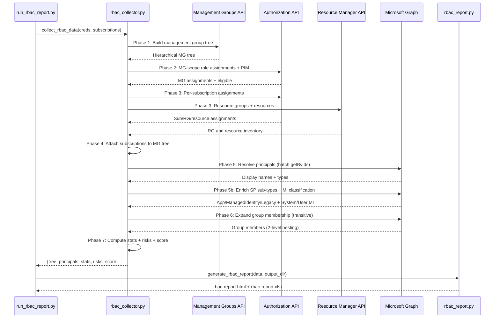

# RBAC Reporting — Deep Dive

> **Executive Summary** — Deep technical reference for RBAC Reporting (`rbac_collector.py`, 3,277 lines).
> 7-phase pipeline: hierarchy discovery → role assignment collection → PIM enrichment → risk detection
> → scoring → report generation → Excel export. Tracks 19 privileged roles with 6 risk detection rules.
>
> | | |
> |---|---|
> | **Audience** | Identity & access management teams, auditors |
> | **Prerequisites** | [Architecture](architecture.md) for pipeline context |
> | **Companion docs** | [Agent Capabilities](agent-capabilities.md) for RBAC collector details · [Evaluation Rules](evaluation-rules.md) |

## Overview
- 3-file system: rbac_collector.py (1,101 lines) + rbac_report.py (2,055 lines) + run_rbac_report.py (121 lines)
- Builds full Azure management-group → subscription → resource-group → resource hierarchy
- Collects role assignments + PIM eligibility at every scope level
- Resolves principal identities via Microsoft Graph (batch getByIds + SP enrichment)
- Expands group membership (2-level transitive)
- Produces interactive HTML report with tree navigation, SVG charts, sortable tables
- 8-tab Excel workbook for offline analysis

## Architecture

### 7-Phase Collection Pipeline


### Phase Details
| Phase | Purpose | API Used |
|-------|---------|----------|
| 1 | Build management group hierarchy | `management_groups.get(expand="children", recurse=True)` |
| 2 | Collect MG-scope assignments + PIM | `role_assignments.list_for_scope` + `role_eligibility_schedule_instances` |
| 3 | Per-subscription assignments, RGs, resources | `role_assignments.list_for_subscription` + `resource_groups.list` + `resources.list` |
| 4 | Attach subscription nodes to MG tree | Internal tree manipulation |
| 5 | Resolve principal IDs → names/types | Graph `directory_objects.get_by_ids` (batches of 1,000) |
| 5b | Classify SP sub-types + MI type | Graph `service_principals.get()` (concurrency=10) |
| 6 | Expand group membership | Graph `groups.transitive_members.get()` (2-level) |
| 7 | Stats, risk detection, score | Internal computation |

## 19 Privileged Roles Tracked
1. Owner
2. Contributor
3. User Access Administrator
4. Security Admin
5. Global Administrator
6. Key Vault Administrator
7. Key Vault Secrets Officer
8. Storage Account Contributor
9. Virtual Machine Contributor
10. Network Contributor
11. SQL Server Contributor
12. SQL Security Manager
13. Monitoring Contributor
14. Log Analytics Contributor
15. Automation Operator
16. Managed Identity Operator
17. Role Based Access Control Administrator
18. Azure Kubernetes Service Cluster Admin Role
19. Azure Kubernetes Service RBAC Admin

## Risk Detection Rules (6 categories)
| # | Severity | Condition |
|---|----------|-----------|
| 1 | Critical | Standing Owner or User Access Administrator at MG/Subscription scope |
| 2 | High | Standing Contributor at Management Group scope |
| 3 | High | Service Principal with Owner role (any scope) |
| 4 | High | Group with >20 members holding a privileged role |
| 5 | Medium | Custom role at MG or Subscription scope |
| 6 | Medium | Service Principal with Contributor at MG/Subscription scope |

## RBAC Score Computation
Starts at 100, deductions:
- Critical risk: -15 each
- High risk: -8 each
- Medium risk: -4 each
- Privileged-to-total ratio >50%: -15; >30%: -8
- Zero PIM eligible when privileged active >0: -10
- Clamped to [0, 100]

## HTML Report Features
- **Executive Summary**: Score ring, 8 KPI stat cards, 4 scope cards, identity breakdown, 6 SVG charts
- **Risk Analysis**: Sortable risk findings table with severity badges
- **Hierarchy Tree**: Interactive expandable tree (`<details>/<summary>`) with assignment tables at every node
- **Principal Appendix**: Searchable lookup table
- **Interactive Controls**: Expand/Collapse All, text search filter, status filter, privileged-only toggle, hide-inherited toggle, sortable columns, CSV export, zoom controls
- **Accessibility**: ARIA live regions, keyboard navigation, WCAG 2.1.1 compliant
- **Theme**: Dark/light toggle, shared Fluent Design theme

## Charts Generated (6 SVG)
| Chart | Type | Shows |
|-------|------|-------|
| Active vs Eligible | Donut | Active/PIM split |
| Privileged vs Standard | Donut | Privileged role ratio |
| Top Roles | Horizontal bar | Top 10 most-assigned roles |
| Principal Types | Horizontal bar | Assignments by identity sub-type |
| Scope Distribution | Horizontal bar | MG/Sub/RG/Resource breakdown |
| Risk Severity | Donut | Critical/High/Medium/Low |

## Excel Workbook (8 tabs)
| Tab | Content |
|-----|---------|
| Executive Summary | Score, risk counts, assignment summary |
| All Assignments | Full list (10 columns) |
| Privileged Access | Privileged-only assignments |
| PIM Eligible | PIM-eligible assignments |
| Risk Findings | All risks with PowerShell remediation |
| Principal Directory | All principals (6 columns) |
| Group Membership | Group → member expansion |
| Scope Hierarchy | Indented hierarchy with counts |

## CLI Usage
```bash
# Full RBAC report
python run_rbac_report.py --tenant <tenant-id>

# Specific subscriptions
python run_rbac_report.py --tenant <tenant-id> --subscriptions sub-id-1,sub-id-2

# Custom output directory
python run_rbac_report.py --tenant <tenant-id> --output-dir ./my-output
```

## Output Artifacts
| File | Content |
|------|---------|
| `rbac-data.json` | Raw collector output (tree + principals + stats + risks) |
| `rbac-report.html` | Interactive HTML report |
| `rbac-report.xlsx` | 8-tab Excel workbook |
| `rbac-report.pdf` | PDF conversion |

## Source Files
| File | Lines | Purpose |
|------|-------|---------|
| [`rbac_collector.py`](../AIAgent/app/collectors/azure/rbac_collector.py) | 1,101 | 7-phase data collector |
| [`rbac_report.py`](../AIAgent/app/reports/rbac_report.py) | 2,055 | HTML + Excel report generator |
| [`run_rbac_report.py`](../AIAgent/run_rbac_report.py) | 121 | CLI entry point |
