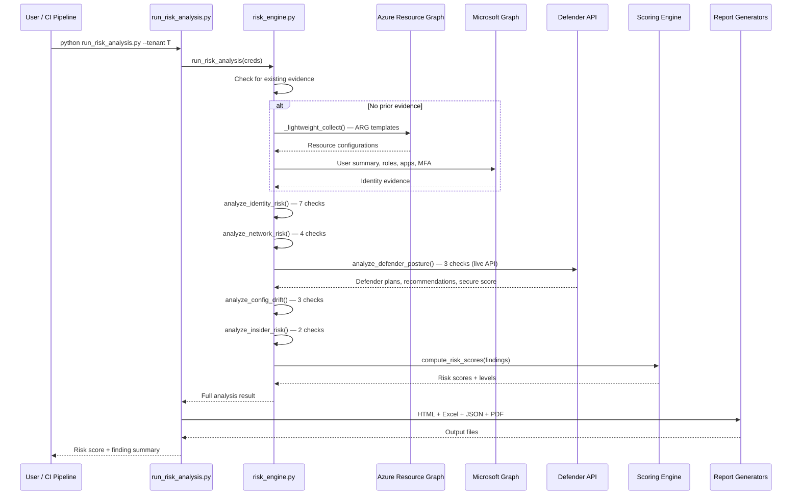

# Risk Analysis Engine — Deep Dive

> **Executive Summary** — Deep technical reference for the Risk Analysis Engine
> (`risk_engine.py`, 1,280 lines). Assesses security risk across 5 categories (identity, network,
> Defender, configuration, insider threat) with 19 individual checks and a weighted scoring model.
>
> | | |
> |---|---|
> | **Audience** | Security analysts, risk managers |
> | **Prerequisites** | [Architecture](architecture.md) for pipeline context |
> | **Companion docs** | [Evaluation Rules](evaluation-rules.md) · [Tenant Assessment](tenant-assessment-deep-dive.md) |

## Overview
- 1,280 lines, purely functional
- Provides attack-surface analysis across 5 risk categories
- 19 individual security checks
- Consumes 14+ evidence types from Entra ID, Azure ARM, Defender, and M365
- Configurable thresholds for stale accounts, MFA, and admin counts
- Includes live Defender API calls for security recommendations and secure score

## Architecture

### Pipeline Flow


## Risk Categories (5) and Checks (19)

### Identity Risk (7 checks)
| Check | Severity | Threshold | What It Detects |
|-------|----------|-----------|-----------------|
| `dormant_accounts` | high | >90 days no sign-in, >20% stale | Stale user accounts |
| `overpermissioned_sps` | critical | Owner/Contributor at sub+ scope | Over-privileged service principals |
| `app_credential_hygiene` | high/medium | Expired or <30 days to expiry | Credential management gaps |
| `mfa_gaps` | critical/high | <90% MFA registration | Missing MFA coverage |
| `admin_proliferation` | high | >5 Global Admins | Excessive admin accounts |
| `guest_risks` | medium | >20% guest ratio | High guest user ratio, no access reviews |
| `risky_users` | critical/high | Identity Protection risk level | Users flagged by Identity Protection |

### Network Risk (4 checks)
| Check | Severity | What It Detects |
|-------|----------|-----------------|
| `open_management_ports` | critical | NSGs allowing RDP/SSH from Internet |
| `public_storage` | high | Storage accounts with public blob access |
| `webapp_security` | high/medium | Web apps without HTTPS or TLS <1.2 |
| `sql_exposure` | critical | SQL servers with 0.0.0.0/0 firewall rules |

### Defender Posture (3 checks — live API)
| Check | Severity | What It Detects |
|-------|----------|-----------------|
| `defender_coverage` | high | Defender plans on Free tier |
| `security_recommendations` | varies | High-severity unhealthy assessments |
| `secure_score` | high/medium | Average secure score <70% |

### Configuration Drift (3 checks)
| Check | Severity | What It Detects |
|-------|----------|-----------------|
| `diagnostic_coverage` | medium | Resources without diagnostic settings (7 diaggable types) |
| `policy_noncompliance` | high/medium | Azure Policy violations |
| `tag_governance` | low | Resources with no tags (>10 untagged) |

### Insider Risk (2 checks)
| Check | Severity | What It Detects |
|-------|----------|-----------------|
| `irm_policy_existence` | medium | No IRM policies or no evidence |
| `irm_active_alerts` | high | Active unresolved IRM alerts |

## Scoring Model
- Severity weights: critical=10, high=7.5, medium=5, low=2.5, informational=1
- Per-category: `min(100, sum(weights) × 5)`
- Overall: weighted average across 5 categories
- Levels: ≥75 Critical, ≥50 High, ≥25 Medium, <25 Low

## Configurable Thresholds
| Parameter | Default | Adjustable Via |
|-----------|---------|----------------|
| `max_stale_percent` | 20% | `thresholds` parameter |
| `min_mfa_percent` | 90% | `thresholds` parameter |
| `max_global_admins` | 5 | `thresholds` parameter |

## CLI Usage
```bash
python run_risk_analysis.py --tenant <tenant-id>
python run_risk_analysis.py --tenant <tenant-id> --evidence raw-evidence.json
python run_risk_analysis.py --tenant <tenant-id> --category identity,network,defender
```

## Output Artifacts
| File | Content |
|------|---------|
| `risk-analysis.json` | Full JSON results |
| `risk-analysis-report.html` | Interactive HTML dashboard |
| `risk-analysis-report.xlsx` | Excel export |
| `*.pdf` | PDF conversion |

## Source Files
| File | Lines | Purpose |
|------|-------|---------|
| [`risk_engine.py`](../AIAgent/app/risk_engine.py) | 1,280 | Core engine — 5 categories, 19 checks |
| [`run_risk_analysis.py`](../AIAgent/run_risk_analysis.py) | ~155 | CLI runner |
