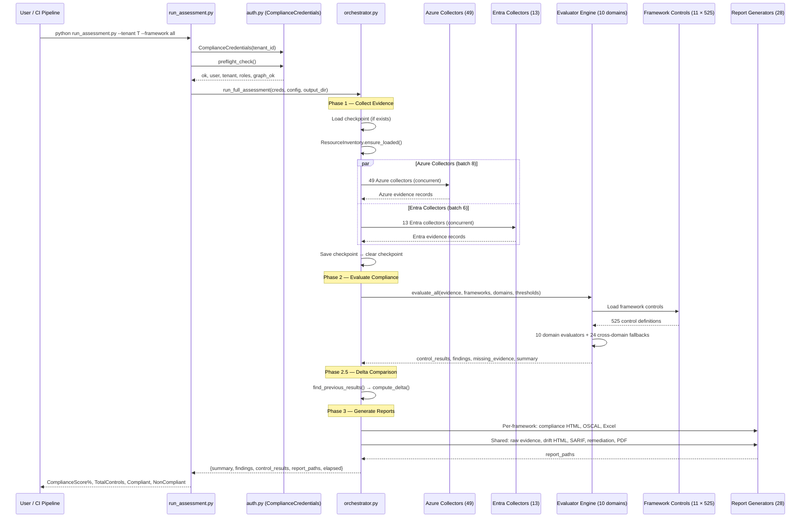

# Tenant Assessment — Deep Dive

> **Executive Summary** — The most comprehensive deep-dive: the full tenant assessment pipeline
> from authentication through report generation. Covers all 64 collectors, 10 evaluation domains,
> 113 check functions, 11 frameworks (525 controls), 28 report generators, checkpoint/resume,
> delta tracking, and 4 authentication modes. The canonical end-to-end pipeline reference.
>
> | | |
> |---|---|
> | **Audience** | Architects, senior engineers, auditors |
> | **Prerequisites** | [Architecture](architecture.md) for structural overview |
> | **Companion docs** | [Evaluation Rules](evaluation-rules.md) · [Configuration Guide](configuration-guide.md) · [Agent Capabilities](agent-capabilities.md) |

## Overview
- Full compliance-assessment orchestration system across 5 core files (~1,339 lines)
- Coordinates 64 collectors (49 Azure + 13 Entra + 2 standalone), 10 domain evaluators, and 28 report generators
- Evaluates against 11 compliance frameworks with 525 total controls
- 3-phase pipeline: Collect → Evaluate → Report
- Checkpoint/resume, delta/drift detection, multi-tenant aggregation
- Deterministic UUID5-based IDs for reproducibility
- Configurable thresholds (17 named parameters), concurrent batching, timeout recovery

## Architecture

### 3-Phase Pipeline


## Core Files

| File | Lines | Purpose |
|------|-------|---------|
| [`run_assessment.py`](../AIAgent/run_assessment.py) | ~130 | CLI entry point — arg parsing, pre-flight, orchestration invoke |
| [`orchestrator.py`](../AIAgent/app/orchestrator.py) | ~543 | 3-phase orchestration: collect → evaluate → report |
| [`models.py`](../AIAgent/app/models.py) | ~232 | Data models — 8 dataclasses, 3 enums, deterministic UUID5 IDs |
| [`config.py`](../AIAgent/app/config.py) | ~154 | Configuration system — 4 config dataclasses, env/file loading |
| [`auth.py`](../AIAgent/app/auth.py) | ~280 | Authentication — 4 auth modes, pre-flight validation |

## Phase 1: Evidence Collection

### Collector Registry
- **Auto-discovery**: `discover_collectors()` imports all modules under `collectors/azure/` and `collectors/entra/` via `pkgutil`
- **Registration**: `@register_collector(name, plane, source, priority)` decorator
  - `plane`: `"control"` (ARM management) or `"data"` (per-resource data plane)
  - `source`: `"azure"` or `"entra"`
  - `priority`: lower = runs earlier (default 100)

### Collector Inventory
| Source | Files | Lines | Batch Size | Timeout |
|--------|-------|-------|------------|---------|
| Azure | 49 | ~8,333 | 8 concurrent | 600s |
| Entra | 13 | ~1,787 | 6 concurrent | 600s |
| **Total** | **64** | **~10,120** | — | — |

### Largest Azure Collectors
| Collector | Lines | Purpose |
|-----------|-------|---------|
| `foundry_config.py` | 1,081 | Azure AI Foundry configuration |
| `rbac_collector.py` | 983 | RBAC hierarchy + assignments |
| `copilot_studio.py` | 370 | Power Platform / Copilot Studio |
| `sharepoint_onedrive.py` | 366 | SharePoint sites, permissions, sharing |
| `m365_compliance.py` | 321 | M365 DLP, IRM, compliance settings |

### Largest Entra Collectors
| Collector | Lines | Purpose |
|-----------|-------|---------|
| `ai_identity.py` | 419 | AI service principals, consent |
| `user_details.py` | 241 | User MFA, auth methods, sign-in |
| `governance.py` | 136 | Access reviews, PIM, entitlements |

### Concurrent Execution
- Azure and Entra collector groups run in **parallel** via `asyncio.gather`
- Within each group, collectors run in batches (Azure: 8, Entra: 6)
- Per-collector timeout: 600s (configurable)
- Timeout recovery: checks `fn._partial_evidence` for partial data

### Checkpoint/Resume
- Saves `.checkpoint.json` during collection with evidence + completed collector list
- On restart, loads checkpoint and skips already-completed collectors
- Cleared after successful collection completes

### Evidence Model
Each evidence record contains:
```
EvidenceId         — deterministic UUID5("evidence", source, collector, type, resource_id)
Source             — azure | entra
Collector          — collector function name
EvidenceType       — evidence category key
Description        — human-readable description
Data               — raw data payload
CollectedAt        — ISO 8601 timestamp
ResourceId         — Azure resource ID (if applicable)
ResourceType       — Azure resource type
```

## Phase 2: Compliance Evaluation

### Evaluator Engine (4,339 lines across 14 files)

#### 10 Domain Evaluators
| Domain | File | Lines | Focus |
|--------|------|-------|-------|
| Access Control | `access.py` | 311 | RBAC, privileged access, ownership |
| Identity | `identity.py` | 518 | MFA, stale accounts, guest management |
| Data Protection | `data_protection.py` | 814 | Encryption, classification, DLP |
| Logging | `logging_eval.py` | 281 | Diagnostic settings, audit retention |
| Network | `network.py` | 577 | NSG, firewall, private endpoints |
| Governance | `governance.py` | 466 | Policy, tagging, compliance |
| Incident Response | `incident_response.py` | 250 | Defender, alerts, IR plans |
| Change Management | `change_management.py` | 152 | DevOps, deployment safeguards |
| Business Continuity | `business_continuity.py` | 175 | Backup, DR, geo-redundancy |
| Asset Management | `asset_management.py` | 145 | Resource inventory, lifecycle |

#### Cross-Domain Fallback
24 evaluation functions are mapped to alternate domains. When a primary domain evaluator returns `not_assessed`, the engine tries the cross-domain evaluator before marking missing.

### 11 Compliance Frameworks (525 Controls)
| Framework | Controls | Focus |
|-----------|----------|-------|
| NIST 800-53 | 83 | Federal information systems |
| FedRAMP | 69 | Federal cloud services |
| CIS Azure | 53 | Azure-specific benchmarks |
| MCSB | 53 | Microsoft Cloud Security Benchmark |
| ISO 27001 | 51 | International security standard |
| PCI-DSS | 51 | Payment card security |
| SOC 2 | 47 | Service organization controls |
| HIPAA | 43 | Healthcare data protection |
| NIST CSF | 29 | Cybersecurity framework |
| CSA CCM | 24 | Cloud controls matrix |
| GDPR | 22 | EU data protection |

### Scoring Formula (Weighted)
$$\text{ComplianceScore} = \frac{\sum \text{earned weights}}{\sum \text{possible weights}} \times 100$$

| Control Severity | Weight | Compliant Earns | Partial Earns | Non-Compliant Earns |
|------------------|--------|-----------------|---------------|---------------------|
| Critical | 4 | 4 | 2 | 0 |
| High | 3 | 3 | 1.5 | 0 |
| Medium | 2 | 2 | 1 | 0 |
| Low | 1 | 1 | 0.5 | 0 |

**Missing evidence / Not assessed → excluded** from both numerator and denominator (don't drag score down).

### Per-Domain Scores
`Compliant / Total × 100` (controls with `missing_evidence` excluded from Total).

### Control Statuses
| Status | Meaning |
|--------|---------|
| `COMPLIANT` | Control fully satisfied |
| `NON_COMPLIANT` | Control violated |
| `PARTIAL` | Partially satisfied (50% credit) |
| `NOT_ASSESSED` | Could not evaluate (excluded from score) |
| `MISSING_EVIDENCE` | Evidence absent (excluded from score) |

### Finding Model
```
FindingId          — UUID5("finding", control_id, framework, domain, description, resource_id)
ControlId          — framework control identifier
Framework          — framework name
ControlTitle       — human-readable title
Status             — COMPLIANT | NON_COMPLIANT | PARTIAL | ...
Severity           — critical | high | medium | low | informational
Domain             — one of 10 evaluation domains
Description        — detailed finding description
Rationale          — why this status was assigned
Recommendation     — remediation guidance
EvidenceIds        — linked evidence records
ResourceId         — affected Azure resource
```

## Phase 2.5: Delta Comparison
- `find_previous_results(output_dir)` — scans for prior assessment results
- `compute_delta(results, previous)` — compares resource sets, findings, scores
- Generates drift report HTML if changes detected
- Delta saved as `.last_run.json` for future comparisons

## Phase 3: Report Generation

### 28 Report Generators (17,156 lines)
| Generator | Lines | Output Format | Content |
|-----------|-------|---------------|---------|
| `compliance_report_html.py` | 1,680 | HTML | Per-framework compliance dashboard |
| `compliance_report_md.py` | 356 | Markdown | Per-framework compliance |
| `html_report.py` | 465 | HTML | Generic HTML report |
| `markdown_report.py` | 135 | Markdown | Generic markdown |
| `excel_export.py` | 236 | XLSX | Tabular compliance export |
| `json_report.py` | 39 | JSON | Raw JSON output |
| `sarif_export.py` | 119 | SARIF | Static analysis format |
| `oscal_export.py` | 102 | OSCAL | Federal compliance format |
| `pdf_export.py` | 85 | PDF | HTML-to-PDF conversion |
| `executive_dashboard.py` | 222 | HTML | Executive-level dashboard |
| `executive_summary.py` | 326 | HTML | Summary for leadership |
| `master_report.py` | 594 | HTML+MD+XLSX | All findings flat table |
| `methodology_report.py` | 420 | HTML | Assessment methodology documentation |
| `remediation.py` | 547 | Scripts | Remediation playbooks |
| `delta_report.py` | 125 | HTML | Run-over-run comparison |
| `drift_report_html.py` | 119 | HTML | Configuration drift detection |
| `gaps_report.py` | 473 | HTML | Compliance gaps analysis |
| `evidence_catalog.py` | 321 | — | Evidence enrichment layer |
| `inventory.py` | 167 | — | Resource inventory |
| `trending.py` | 47 | — | Trend tracking |
| `notifications.py` | 70 | — | Alert/notification hooks |
| `data_exports.py` | 59 | JSON | Data file exports |
| `shared_theme.py` | 294 | CSS/JS | Shared Fluent Design theme |
| `data_security_report.py` | 3,348 | HTML | Data security (standalone tool) |
| `copilot_readiness_report.py` | 3,409 | HTML | Copilot readiness (standalone tool) |
| `rbac_report.py` | 1,913 | HTML+XLSX | RBAC analysis (standalone tool) |
| `ai_agent_security_report.py` | 1,518 | HTML | AI agent security (standalone tool) |
| `risk_report.py` | 917 | HTML | Risk analysis (standalone tool) |

### Multi-Framework Mode
When >1 framework selected:
- Creates per-framework subfolders: `output/<timestamp>/<framework_name>/`
- Each gets filtered control_results, findings, missing_evidence
- Per-framework summary with `DomainScores`
- Framework-level severity counts

### Report Safety
Each report generator is wrapped in `try/except` with `_safe()` helper — individual failures don't block other reports.

## Authentication

### 4 Auth Modes
| Mode | Credential Class | Use Case |
|------|-----------------|----------|
| `auto` (default) | `DefaultAzureCredential` | Picks up az login, MI, or env vars |
| `azurecli` | `AzureCliCredential` | Explicit CLI session |
| `serviceprincipal` | `ClientSecretCredential` | CI/CD pipelines |
| `appregistration` | `ClientSecretCredential` | App registration with Graph consent |

### Pre-Flight Validation (4 steps)
1. **ARM check**: List subscriptions — error if fails, warning if 0
2. **Graph /me check**: Resolve user principal name
3. **Entra role check**: Verify sufficient roles (Global Admin, Global Reader, Security Admin, Security Reader, Compliance Admin)
4. **Graph endpoint probes**: Test Users, ConditionalAccess, RoleManagement endpoints

## Configuration

### AssessmentConfig
| Field | Default | Purpose |
|-------|---------|---------|
| `name` | `"EnterpriseSecurityIQ Assessment"` | Assessment name |
| `frameworks` | `["FedRAMP"]` | Target frameworks |
| `log_level` | `"INFO"` | Logging level |
| `output_formats` | `["json", "html"]` | Report output formats |
| `output_dir` | `"output"` | Base output directory |
| `checkpoint_enabled` | `True` | Enable checkpoint/resume |
| `additional_tenants` | `[]` | Multi-tenant assessment |

### CollectorConfig
| Field | Default | Purpose |
|-------|---------|---------|
| `azure_enabled` | `True` | Toggle Azure collectors |
| `entra_enabled` | `True` | Toggle Entra collectors |
| `azure_batch_size` | `8` | Max concurrent Azure collectors |
| `entra_batch_size` | `6` | Max concurrent Entra collectors |
| `collector_timeout` | `600` | Per-collector timeout (seconds) |
| `user_sample_limit` | `0` | Max users for detail collection (0=all) |

### ThresholdConfig (17 parameters)
| Parameter | Default | Domain |
|-----------|---------|--------|
| `max_subscription_owners` | 3 | Access |
| `max_privileged_percent` | 20% | Access |
| `max_global_admins` | 5 | Access |
| `max_subscription_contributors` | 10 | Access |
| `max_entra_privileged_roles` | 10 | Access |
| `min_mfa_percent` | 90% | Identity |
| `max_no_default_mfa_percent` | 30% | Identity |
| `max_stale_percent` | 20% | Identity |
| `max_stale_guests` | 10 | Identity |
| `max_high_priv_oauth` | 5 | Identity |
| `max_admin_grants` | 20 | Identity |
| `max_not_mfa_registered` | 10 | Identity |
| `diagnostic_coverage_target` | 80% | Logging |
| `diagnostic_coverage_minimum` | 50% | Logging |
| `min_policies_for_baseline` | 5 | Governance |
| `min_tagging_percent` | 80% | Governance |
| `policy_compliance_target` | 80% | Governance |

### Config Loading
- **`from_env()`**: Checks `ENTERPRISESECURITYIQ_CONFIG` env var for JSON path, then applies env overrides: `AZURE_TENANT_ID`, `ENTERPRISESECURITYIQ_AUTH_MODE`, `AZURE_SUBSCRIPTION_FILTER`, `ENTERPRISESECURITYIQ_FRAMEWORKS`, `ENTERPRISESECURITYIQ_LOG_LEVEL`
- **`from_file(path)`**: Loads JSON config file with nested `auth{}`, `collectors{}`, `thresholds{}` sections

## Data Models

### Dataclasses (8)
| Class | Purpose |
|-------|---------|
| `ResourceContext` | Azure resource metadata (ID, name, type, subscription, RG, location, tags) |
| `EvidenceRecord` | Collected evidence with deterministic ID |
| `FindingRecord` | Compliance finding with severity, status, remediation |
| `ComplianceControlResult` | Aggregated control result (compliant/non-compliant counts) |
| `MissingEvidenceRecord` | Tracked missing evidence (excluded from scoring) |
| `CollectorResult` | Per-collector execution result |
| `AssessmentSummary` | Overall assessment metadata and scores |
| `CheckpointState` | Checkpoint persistence model |

### Deterministic ID Generation
`UUID5(namespace, "type|field1|field2|...")` ensures same inputs produce same IDs across runs:
- Namespace: `c0a80164-dead-beef-cafe-000000000001`
- Evidence: `"evidence|source|collector|type|resource_id"`
- Finding: `"finding|control_id|framework|domain|description|resource_id"`
- Assessment: `"assessment|tenant_id|frameworks_joined"`

## CLI Usage

```bash
# Full assessment with all frameworks
python run_assessment.py --tenant <tenant-id> --framework all

# Specific frameworks
python run_assessment.py --tenant <tenant-id> --framework FedRAMP ISO-27001 PCI-DSS

# Interactive framework selection (prompted)
python run_assessment.py --tenant <tenant-id>

# With config file
ENTERPRISESECURITYIQ_CONFIG=config/enterprisesecurityiq.config.json python run_assessment.py
```

### CLI Arguments
| Flag | Required | Description |
|------|----------|-------------|
| `--tenant` / `-t` | No | Azure tenant ID (prompted if omitted) |
| `--framework` / `-f` | No | Framework(s): `all` or specific names |

## Output Artifacts

| Artifact | Location | Format |
|----------|----------|--------|
| Per-framework compliance report | `<framework>/` | HTML + XLSX + OSCAL |
| Raw evidence | Root | JSON |
| Data exports | Root | JSON |
| Drift report | Root | HTML |
| SARIF export | Root | SARIF |
| Remediation playbooks | Root | Scripts |
| PDF conversions | Root | PDF |
| Checkpoint (transient) | Root | `.checkpoint.json` |
| Last-run metadata | Root | `.last_run.json` |

Output directory structure:
```
output/YYYYMMDD_HHMMSS_AM/
├── FedRAMP/
│   ├── compliance-report.html
│   ├── compliance-report.xlsx
│   └── oscal-export.json
├── ISO-27001/
│   └── ...
├── raw-evidence.json
├── data-exports/
├── drift-report.html
├── sarif-export.sarif
├── remediation/
├── *.pdf
├── .last_run.json
└── .checkpoint.json (transient)
```

## Multi-Tenant Assessment
- `run_multi_tenant_assessment()` iterates `primary + additional_tenants`
- Each tenant gets own subfolder: `output/tenant-{id[:8]}/`
- Findings tagged with `TenantId` and `TenantName`
- Aggregated summary: `MultiTenant: True`, per-tenant scores, overall compliance

## Error Handling & Resilience
| Feature | Behavior |
|---------|----------|
| Checkpoint/resume | Saves progress during collection; resumes from checkpoint on restart |
| Timeout recovery | Checks `fn._partial_evidence` for partial data from timed-out collectors |
| Collector failures | Logged, tracked in `failed_collectors`; assessment continues |
| Report failures | Each generator wrapped in `try/except`; individual failures don't block others |
| Access-denied tracking | Extracted from evidence `EvidenceType == "access-denied"`, reported in output |
| Credential rotation | `DefaultAzureCredential` fallback chain |

## Integration Points

| Module | Purpose |
|--------|---------|
| `app.evaluators.engine` | `evaluate_all()` — framework-based compliance evaluation |
| `app.collectors.registry` | `discover_collectors()`, `get_collector_functions()` — auto-discovery |
| `app.collectors.inventory` | `ResourceInventory` — ARM resource cache |
| `app.reports.*` | 28 report generators |
| `app.frameworks/*-mappings.json` | 11 framework control definitions |

## Source Files Summary

| Component | Files | Lines | Key Count |
|-----------|-------|-------|-----------|
| Orchestration | 5 | ~1,339 | 3 phases, 4 auth modes |
| Evaluators | 14 | 4,339 | 10 domains, 24 cross-domain |
| Azure Collectors | 49 | ~8,333 | Batch 8, 600s timeout |
| Entra Collectors | 13 | ~1,787 | Batch 6, 600s timeout |
| Report Generators | 28 | 17,156 | 10+ output formats |
| Frameworks | 11 JSON | — | 525 total controls |
| **Total** | **119** | **~33,000** | — |
